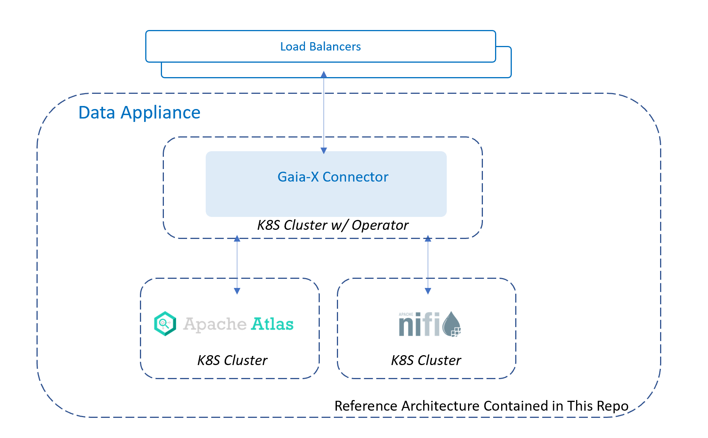
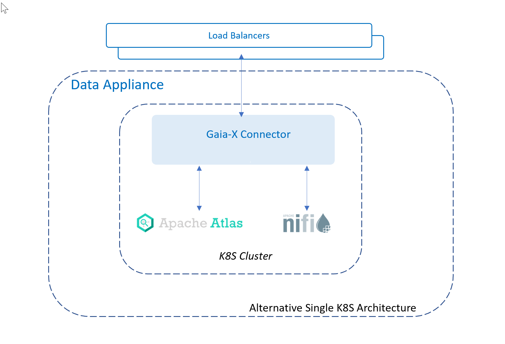

# Gaia-X Data Appliance Installation Guide

This document describes how to install the components of the Gaia-X data appliance to allow developers to experiment with the system.

There are three components to the Gaia-X Data Appliance:

1. The Connector Component
2. The Data Catalog Component
3. The Data Transfer Component

Alternatively, the three data appliance components can be deployed to a single cluster with the appropriate K8S services configured for inter-component communication, plus the K8S ingress required to manage each component. This configuration is not currently documented in this repo but nothing should prohibit co-locating components in the same cluster. 

The Data Appliance solution is designed to be pluggable in order to support different backend technologies for handling data catalogs and data transfer. These instructions use [Apache Atlas](https://atlas.apache.org/) for the data catalog component and [Apache NiFi](https://nifi.apache.org/) for the data transfer component. This guide includes installation steps for deploying both technologies into existing Azure Kubernetes Clusters.

# Table of Contents

## Data Transfer -- Nifi

1. [Nifi Setup Instructions](./data-transfer/NiFiSetup.md)
1. [Deploying Gaia-X Data Transfer Component to a Nifi Instance](./data-transfer/NifiDataFlowDeploy.md)
1. [Initiating a transfer in Nifi using the Data Transfer Component](./data-transfer/apache-nifi/templates/README.md)

## Data Catalog -- Atlas

1. [Atlas Setup Instructions](./data-catalog/apache-atlas/atlas-helm-chart/README.md)
2. [Deploying Gaia-X Data Catalog Components to an Atlas Instance](./data-catalog/deploy-gaiax-data-components/readme.md)

## Connector

1. Connector Deployment Instructions
1. Example Connector Requests
