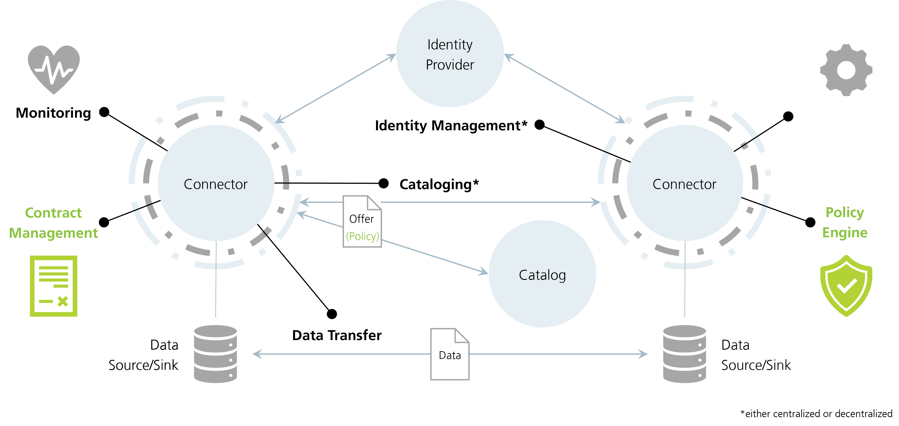

# Eclipse Dataspace Connector

**Please note**: Work in progress. All content of provided documentation reflects the current state of discussion.

## Overview

Data spaces allow organizations to securely share data with others. They enable data cooperation in a multi-cloud 
federation by focusing on identity, trust, sovereignty, and interoperability.

- Identity: Each participant remains in control of their identity.
- Trust: Each participant decides who to trust.
- Sovereignty: Each participant decides under what policies their data is shared.
- Interoperability: Each participant remains in control of their deployment.

Since the concept of data spaces is emerging and promises new capabilities to the data exchange between participants 
(organizations) in terms of data sovereignty, many may ask the questions "What is a connector?" and "When and why should 
I use it?".

**What is a connector?**

A participant in a data space wants to share and consume data offers, transfer data, and - most important - maintain
control over its usage. All processes are based on the aforementioned principles of identity, trust, sovereignty, and 
interoperability. This is why a connector component is used to participate in a data space and mainly focuses on
these aspects while ensuring data sovereignty along the entire data supply and value chain.

In order to build up and participate in a data space, it is not enough to consider existing communication protocols.
This means, besides the actual data transfer, a connector has to provide capabilities, i.e., for discovering, 
connecting, automated contract negotiation, policy enforcement, and auditing processes. Data space connectors act as 
logical gatekeepers that integrate into each participant’s infrastructure and communicate with each other.

**When to use a data space connector?**

A connector should be used each time the controlling (legal) entity of the data changes. A connector provides a 
generic way to express, negotiate, and document the rules under which data is shared, and also with whom. Not just 
in plain text but machine-readable and technically enforceable.

Existing open-source projects address the technical challenges of cataloguing and transferring data for a wide 
range of use cases. However, there is no open-source effort aimed at providing an interoperable, cross-organization 
framework for data sharing that is built on a common identity model and uniform policy enforcement. This project 
will integrate with existing data exchange technologies and provide these missing pieces to create a system for data 
sharing where each organization is able to exert control over how its shared data is used.

**About the Eclipse Dataspace Connector**

A data-sharing system requires a protocol implementation for policy enforcement among participants. The EDC will 
implement the International Data Spaces (IDS) standard as well as relevant protocols and requirements associated 
with Gaia-X, and thereby provide implementation and feedback to these initiatives. However, the EDC will be 
extensible in a way that it may support alternative protocols.
Its added value is achieved through the separation of control and data plane, which enables a modular and 
thereby customizable way to build data spaces. Due to common interfaces and mapping of existing standards, the EDC 
adds capabilities of contract negotiating and policy handling in an interoperable manner.

**Open, community-driven and extensible**

As an open source project hosted by the Eclipse Foundation, the EDC provides a growing list of modules for many
widely-deployed cloud environments (AWS, Azure, GCP, OTC, etc.) "out-of-the-box" and can easily be extended for
more customized environments, while avoiding any intellectual property rights (IPR) headaches.

### How to get started

According to the [Eclipse Foundation Development Process](https://www.eclipse.org/projects/dev_process/#2_3_Three_Communities),
each person that interacts with and is interested in an Eclipse Foundation project can be assigned to specific roles: developers,
users, and adopters. This documentation addresses all of them by defining explicit sections, next to the general information 
and overviews. Depending on your interests, you can take a look at one or more of the following.

- **Adopter**: Adopters are the individuals and organizations that adopt Eclipse technology for inclusion in their own products and services.
- **Developer**: Developers are committers or contributors. A contributor is anybody who makes contributions to a project. A 
committer is a software developer who has the necessary rights to make decisions regarding a Project.
- **User**: Users use the project to realize use cases. They do not want to contribute code or customize the software; they want 
to use it as-is. Users provide valuable feedback and proof that a project is useful and needed.

No matter what role you assign yourself to, if you want to become familiar with the EDC and its functionalities,
please take a look at our [hands-on](overview/hands-on.md) section and samples. 

### How to contribute

All developments follow the [principles defined by the Eclipse Foundation](https://www.eclipse.org/projects/handbook/#preamble-principles).
* Transparency: A project’s discussions, minutes, deliberations, project plans, plans for new features, and other 
artifacts are open, public, and easily accessible.
* Openness: The project is open to all. Everyone has the same opportunities; everyone participates with the same rules.
* Meritocracy: The more that somebody contributes, the more responsibility they will earn.
* Vendor-neutrality: No vendor is permitted to dominate a project, and nobody can be excluded from participating 
in a project based on their employment status.

If you want to know more about actually contributing code, please find more information [here](./_helper/contributing.md) 
and take a look at our [developer documentation](./developer/README.md).

> To join our Discord server, you may use [this](https://discord.gg/n4sD9qtjMQ) invite. 
Details about our biweekly open Q&A session can be seen [here](https://github.com/eclipse-dataspaceconnector/DataSpaceConnector/discussions/1303).

## Statement: EDC vs DSC

_Also to be read on [GitHub](https://github.com/eclipse-dataspaceconnector/DataSpaceConnector/discussions/1037)._

**The Eclipse Dataspace Connector (EDC) expands and improves the Dataspace Connector (DSC) as a follow-up development 
by an OSS community that is being contributed to the various initiatives that are involved in building data spaces. 
Both connectors do _not_ have the same codebase, but follow the same ideas of sovereign data spaces.**

The DSC is a component previously developed by Fraunhofer ISST. The goal was to build an IDS-compliant connector 
driven by a community (e.g., from initiatives as Catena-X, Gaia-X, Mobility Data Space) as OSS to foster distribution 
and usage. While some discussions with several partner organizations begin/mid last year, it became very clear that 
the underlying governance and rules for contributions did not fit the requirements to form such a community and work 
on the code together due to questions regarding intellectual property (IP), licensing, etc.

As a solution, partners agreed in June '21 to create a project within the Eclipse Foundation (EF), since EF provides 
clear governance structures and rules allowing exactly the collaboration and community building, it was aimed for.
While the transfer process and meetings with initial committers (among others), the architecture was rethought to 
directly address future requirements in terms of applicability, robustness, scaling, etc. A much-discussed issue 
dealt with the limitation to a single data protocol such as the IDS vs. a solution that can support multiple such 
protocols. The decision fell on the latter and so the EDC is now developed based on a new architecture and design 
principles but based on available parts (like the DSC) that were transferred as initial contributions to the EF 
(see the [project's proposal](https://projects.eclipse.org/proposals/eclipse-dataspace-connector)). This time 
with a [community of various companies](https://projects.eclipse.org/projects/technology.dataspaceconnector/who) 
that bring in requirements from different initiatives like Catena-X, Eona-X, IDSA, Gaia-X, or MDS, and work on 
a decentralized data space implementation based on a data space connector that provides capabilities for data 
exchange and extensibility to various shared service implementations (catalog, identity, usage control, logging, etc.) 
through interfaces. Thereby, the EDC can support IDS(A)-based components like the DAPS (Identity), or Metadata Broker 
(Catalog) as well as other approaches like WEB-DID (Identity) or Federated Catalog (Catalog). All with the same core 
to enable organizations to use a single technology to participate in multiple data spaces/ecosystems/federations in 
parallel.

## Correlating projects

**Please note**: Not every project may be mentioned here. If you want to add one, please feel free to open a PR
or provide us with information via an issue.

| Name       | Description |
| :--------- | :---------- |
| Gaia-X     | The EDC allows organizations to exchange data compliant to rules and policies of the Gaia-X AISBL according to the corresponding Trust Framework |
| Catena-X   | Uses the EDC as Connector component to build a data space between participants |
| Tractus-X  | Eclipse Foundation OSS project initiated by Catena-X consortia, where specific (Catena-X related) EDC-extensions can be implemented under clear governance and rules |

## Important links

If you want to get more information, besides the one provided here, you may take a look
at the following links:

| Name       | Link |
| :--------- | :--- |
| Homepage                  | <https://dataspace-connector.io/> (in progress) |
| Eclipse project page      | <https://projects.eclipse.org/projects/technology.dataspaceconnector> |
| EDC project proposal      | <https://projects.eclipse.org/proposals/eclipse-dataspace-connector> |
| YouTube Channel           | <https://www.youtube.com/channel/UCYmjEHtMSzycheBB4AeITHg> |
| LinkedIn                  | in progress |
| Main Repository           | <https://github.com/eclipse-dataspaceconnector/DataSpaceConnector> |
| Documents & presentations | <https://github.com/eclipse-dataspaceconnector/Collateral> |
| Publications              | <https://github.com/eclipse-dataspaceconnector/Publications> |
