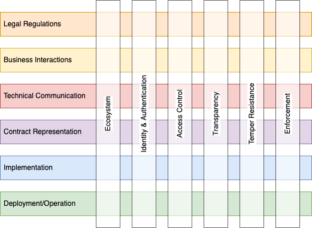

# Usage Control

## Content:

- [Overview & Viewpoints](./README.md)
- [Contracts](contracts.md)
- [Enforcement](enforcement.md)
- [Policies](policies.md)
- [Ecosystem](ecosystem.md) (TODO)
- ...

## Overview

Usage Control is a concept to expand data protection from the provider system to the IT environment of the user. Similar to Security, Usage Control is never absolute but depends on the requirements and threads of each use case. Also similar to Security, Usage Control requires a comprehensive treatment as the overall control level is only as strong as its weakest aspect.

Due to the complexity of the topic and the huge amount of influencing factors, a matrix structure is outlined how to organise the various aspects, shown below. The respective aspects are grouped in _viewpoints_, each regarding a dedicated set of _concerns_, which have been introduced through identified _stakeholders_. The approach follows roughly the specifications of ISO/IEC 42010 and uses its terminology in the following.

*Matrix of horizontal and vertical viewpoints of Usage Control.*

Separating the concerns and simplifying the discussion, the interdependencies of the horizontal viewpoints are mostly limited to the direct neighbors. The vertical viewpoints affect all horizontal ones while in themselves do not provide a native hierarchy.  
