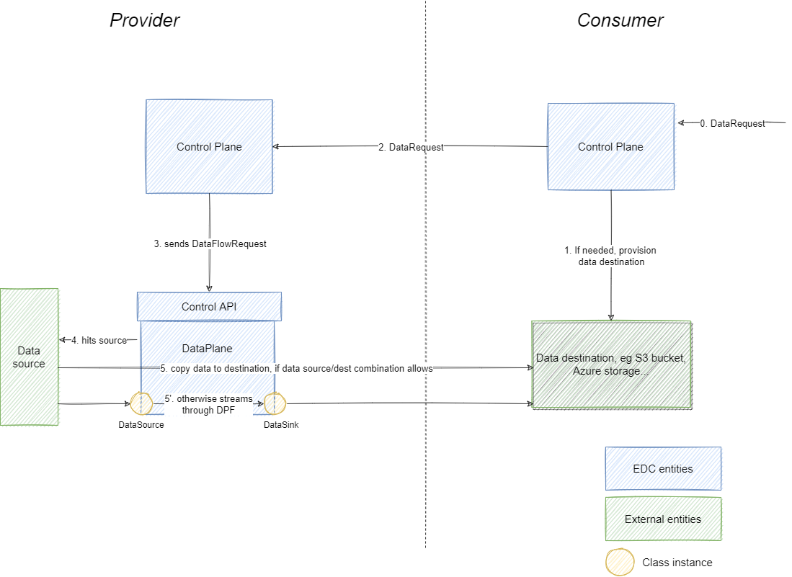

# DPF Transfer

Once two partners of a Dataspace agree on the terms, the respective Control Plane of the provider and consumer will
orchestrate the actual data transfer. The DPF supports two transfer directions:

- client pull (sync): data provider returns to the consumer an entry point (url+token) that he can then use to query the
  data as long as policies and contract allow. This entry point corresponds to the public API exposed by a DPF instance.
- provider push (async): the provider Control Plane directly delegates the data transfer to one Data Plane instance.
  Note that data might continue to arrive after the actual data request (event streaming).

The `data-plane-transfer` module provides the extensions to orchestrate these two types of transfer.

## Client Pull / Synchronous data transfer

The `data-plane-transfer-sync` extension provides resources in order to perform synchronous data transfer using the DPF
and should be embedded within the Control Plane runtime as soon as we plan to handle synchronous data transfer. The DPF
exposes a public API enabling to actively query data. This public API takes as input a bearer token which:

- is used to control the authorization of the request sender,
- contains the data address from which DPF will have to retrieve the data.

The cornerstone of this synchronous extension is therefore to build and forward this bearer token that will be later
used by the backend application of the consumer.

### Token construction and dispatch

The token is first created on provider side within `ProviderDataPlaneProxyDataFlowController`. This `DataFlowController`
implementation is triggered for every data request having _HttpProxy_ as destination type.

This data flow controller resolves the data source address from the asset id contained in the data request and build a
signed token containing this data address (formatted as an encrypted string) as claim. This token is then put into
an `EndpointDataReference` (EDR) object along with the public API URL of the DPF instance from which data will be
queried.

This EDR is then sent to the consumer Control Plane through the `RemoteMessageDispatcherRegistry`.

This provider `EndpointDataReference` is then sent to the consumer Control Plane.

The consumer Control Plane will then wrap this provider `EndpointDataReference` into a data address with type `HttpData`
and generate a _consumer_ `EndpointDataReference` whose target URL will this time be the **consumer** DPF public API.
The consumer Control Plane will also generate a signed token having as claims:

- the contract id which is the same as the one present in the `EndpointDataReference` generated by the provider Control
  Plane,
- the `EndpointDataReference` generated by the provider Control Plane wrapped as a `HttpData` data address and formatted
  as an encrypted string.

This step of converting the _provider_ `EndpointDataReference` into a _consumer_ `EndpointDataReference` is performed by
the `DataPlaneProxyManager`.

To sum-up, the final consumer `EndpointDataReference` returned to the consumer backend application contains a target URL
which is the public API of the consumer DPF, and a bearer token signed by the consumer Control Plane and containing as
claims:

- the contract id,
- a data address with type `HttpData` representing the `EndpointDataReference` generated by the provider and containing:
    - a URL to the provider DPF public API,
    - a bearer token signed by the provider Control Plane and containing as claims the address of the actual data
      source.

As both provider and consumer Control Planes have both signed the final token, it prevents the direct access to the
provider DPF without going through the consumer DPF, thus enabling proper isolation and policy enforcement.

### Validation API

Second part of the extension is an API which is used by the Data Plane in order to validate the bearer token (see
sections above) received in input of the public API request. This validation consists in:

- checking token signature, i.e. verify it has been signed by the Control Plane.
- asserting that the token is still valid and that the Contract still allows access to the data.

If both conditions are satisfied then the data address from the claims is decrypted and returned to the Data Plane which
will then perform the data transfer.

### Flow diagram

## Provider push

The `data-plane-transfer-client` extension provides resources enabling the Control Plane to delegate a data transfer to
the DPF through its Control API (internal API only exposed to the Control Plane). This extension provides
a `DataFlowController` implementation called `DataPlaneTransferFlowController` which is triggered for any destination
type except `HttpProxy` which is reserved for synchronous data transfers as detailed above. This flow controller first
resolves the data address based on the asset id coming from the `DataRequest` and then map a `DataFlowRequest` out of
it. This `DataFlowRequest` is finally forwarded to the Data Plane, which takes care of the actual data transfer.

There are two possible configurations:

- DPF is embedded in the Control Plane runtime: this is mostly a configuration used for testing, demo...
- DPF runs in a separated runtime (generally in the same cluster): this is the typical production configuration. Here
  the Control Plane must also resolve to which DPF instance it should delegate the data transfer to.

### Data Plane is embedded in Control Plane runtime

The central piece of the DPF is the `DataPlaneManager` service, which is registered by
the `data-plane:data-plane-framework` extension. Thus, we rely on the presence/absence of this service in order to check
whether the DPF is embedded in the Control Plane runtime or not. This is equivalent to checking whether the runtime
contains the `data-plane:data-plane-framework` extension. If yes, then a `EmbeddedDataPlaneTransferClient` is created
which embarks the local `DataPlaneManager` and passed to the `DataPlaneTransferFlowController`. The `DataPlaneManager`
service is here directly used to perform the request validation (fail-fast checks) and to trigger the actual data
transfer from the present runtime.

### Data Plane is in a different runtime

If no `DataPlaneManager` is embarked within the Control Plane runtime, then it delegates the data transfer to a DPF
runtime. This is performed by the `RemoteDataPlaneTransferClient`. First this client resolves which DPF instance will
perform the data transfer by calling the Plane Selector API (see [here](./dpf_selector.md) for more details) which
resolves the source/destination data address pair into a `DataPlaneInstance`. Note that if no DPF instance can process
the data transfer, then an error is returned.

Once a DPF instance has been found, the client simply sends the `DataFlowRequest` to its Control API.

### Flow diagram

 
