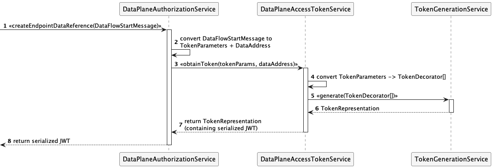
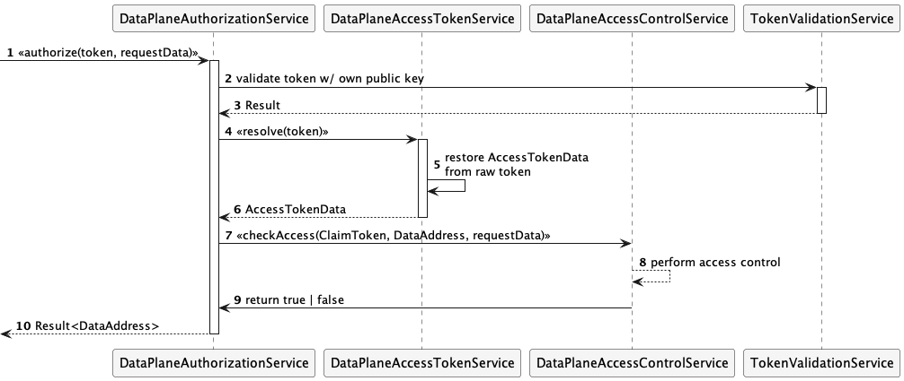

# EDC Data Plane EDR Handling and Extensibility

A prerequisite for the changes described here
is [Data Plane Signaling](data-plane-signaling.md).
The signaling architecture transitions responsibility for EDR creation and data plane access token handling from Control
Plane services to the Data Plane. As a companion to that work, the refactoring effort outlined in this document adds key
features to access token handling in the Data Plane Framework (DPF). Specifically, the following will be introduced:

- Client-side management and API for Endpoint Data References (EDR). Facilities for persisting and updating EDRs
  received from data providers will be implemented. The API will provide a RESTful query interface to client
  applications for retrieving EDRs.
- An extension point for integrating custom authorization token handling. For example, a third-party authorization
  server can be used to create and verify access tokens, or custom access logic can be introduced into the authorization
  flow.

> Note that the DPF also supports OAuth client authentication flows for accessing backend data sources and sinks. That
> feature will not be affected by this refactoring.

## 1. Client-Side EDR Management

The Client EDC will expose an EDR API that provides operations to resolve EDRs as `DataAddress` types by asset ID,
contract agreement ID, and transfer process ID.

A modified version of
the [EndpointDataReferenceCache‎](/spi/common/edr-store-spi/src/main/java/org/eclipse/edc/edr/spi/store/EndpointDataReferenceCache.java)
and EDR API will be upstreamed to EDC as part of that work. The `EndpointDataReferenceCache` will receive and
persist `EDRs` sent from provider control planes (e.g., when a transfer process has been `STARTED`). The EDR API is
intended to be used by client applications to resolve `EDRs` granting access to provider data endpoints.

> The API must be segmented from the rest of the management API using a separate API key or role (TBD).

## 2. Updates to the`DataAddress` Format

The format of the Data Address returned by the EDR API will be updated to align with the current DSP specifications (
backward compatibility to the existing format should be maintained by retaining the previous fields):

```json
{
  "dspace:dataAddress": {
    "@type": "dspace:DataAddress",
    "dspace:endpointType": "https://w3id.org/idsa/v4.1/HTTP",
    "dspace:endpoint": "http://example.com",
    "dspace:endpointProperties": [
      {
        "@type": "dspace:EndpointProperty",
        "dspace:name": "https://w3id.org/edc/v0.0.1/ns/authorization",
        "dspace:value": "token"
      },
      {
        "@type": "dspace:EndpointProperty",
        "dspace:name": "https://w3id.org/edc/v0.0.1/ns/authType",
        "dspace:value": "bearer"
      }
    ]
  }
}
```

Support for the optional DSP `https://w3id.org/edc/v0.0.1/ns/authType` property will be added. If present, its value must be `bearer,` which indicates
clients must present the contained token as a bearer token to the associated HTTP endpoint.

_Note that all endpoints must be represented as URI-style strings._

## 3. Data Plane Authorization

Data Plane authorization involves creating an access token as part of the EDR when a `DataFlowStartMessage` is received
and performing authorization checks against the token presented by the client when a data request is issued to the
provider data plane.

These operations will be encapsulated in the `DataPlaneAuthorizationService`:

```java
public interface DataPlaneAuthorizationService {
    Result<DataAddress> createEndpointDataReference(DataFlowStartMessage message);

    Result<DataAddress> authorize(String token, Map<String, Object> requestData);
}
```

### Public endpoint resolution

In addition to creating an access token (see next section), the data plane must determine the public endpoint, where
consumers can obtain the data. In the case of HTTP, this would be the internet-facing HTTP URL of the data plane ("
public url"), e.g. `"http://example.com"`, and the type would be `"https://w3id.org/idsa/v4.1/HTTP"`.
This tuple consisting of `endpoint` and `endpointType` is determined by another service called
a `PublicEndpointGenerator` (as public endpoints could be dynamically _generated_):

```java
public interface PublicEndpointGenerator {
    Endpoint generateEndpoint(DataAddress sourceDataAddress);
}

public record Endpoint(String endpoint, String endpointType) {


}
```

Note that the `endpoint` is represented as URI-style string. Thus, both `endpoint` and `endpointType` are _always_
Strings. The shape of the `endpoint` is specific to each source type and must be documented out-of-band.

### EDR and Token Creation

When `DataPlaneAuthorizationService.createEndpointDataReference()` is invoked, the service will delegate to
the `DataPlaneAccessTokenService.obtainToken()` to create the authorization token and package it in an EDR. There could
be a separate `DataPlaneAccessTokenService` per `endpointType`, effectively enabling the data plane to generate
different tokens for each transfer type.

The `DataPlaneAccessTokenService` is a defined extensibility point that can be used to integrate third-party
authorization servers:

```java
public interface DataPlaneAccessTokenService {
    Result<TokenRepresentation> obtainToken(TokenParameters parameters, DataAddress address);

    Result<AccessTokenData> resolve(String token);
}

public record AccessTokenData(ClaimToken claimToken, DataAddress address) {
}
```

When `DataPlaneAccessTokenService.obtainToken()` is called, `TokenParameters` will contain (at least) the
following claims:

```java 
String participantId;
String processId;
String assetId;
String agreementId;
String transferType;
```

The returned `TokenRepresentation` may contain an additional parameter `tokenType` indicating the token type,
e.g., `bearer`.

Additional parameters may be added in the future so `DataPlaneAccessTokenService` implementations must take care to
handle them.

A default in-process `DataPlaneAccessTokenService` implementation will delegate to the existing `TokenGenerationService`
and `TokenValidationService` using a custom token decorator context (`edc:dataplane`).

The token creation flow is illustrated by the following sequence diagram:



### Request Authorization

Request authorization is performed when a client issues a request to the provider Data Plane by dispatching
to `DataPlaneAuthorizationService.authorize()`. The `authorize` method takes the `token` and `requestData`, which
encapsulates the token and transport-specific request information as a `Map`, e.g., the HTTP request path:

```java
 Result<DataAddress> authorize(String token, Map<String, Object> requestData);
```

`DataPlaneAuthorizationService.authorize`, in turn, will perform a two-step process.

##### `AccessTokenData` Resolution

First, the `DataPlaneAuthorizationService.authorize()` implementation will
invoke `DataPlaneAccessTokenService.resolve()`
to resolve the `AccessTokenData` containing the `DataAddress` and claims associated with the token:

```java
public record AccessTokenData(ClaimToken claimToken, DataAddress address) {

}
```

The `ClaimToken` will contain the claims originally passed in the `TokenParameters` used to create the token:

```java
String participantId;
String processId;
String assetId;
String agreementId;
String transferType;
```

#### Authorization Check

After the `AccessTokenData` is resolved, the `DataPlaneAuthorizationService.authorize` implementation will delegate
to `DataPlaneAccessControlService.checkAccess`:

```java
public interface DataPlaneAccessControlService {
    boolean checkAccess(ClaimToken claimToken, DataAddress address, Map<String, Object> requestData);
} 
```

The authorization flow is illustrated by the following sequence diagram:


A default implementation will be provided that always returns true. Extensions can supply alternative implementations
that perform use-case-specific authorization checks.

> Please note that `DataPlaneAccessControlService` implementation must handle all request types (including transport
> types) in a data plane runtime. If multiple access check implementations are required, creating a multiplexer or
> individual data plane runtimes is recommended.    

