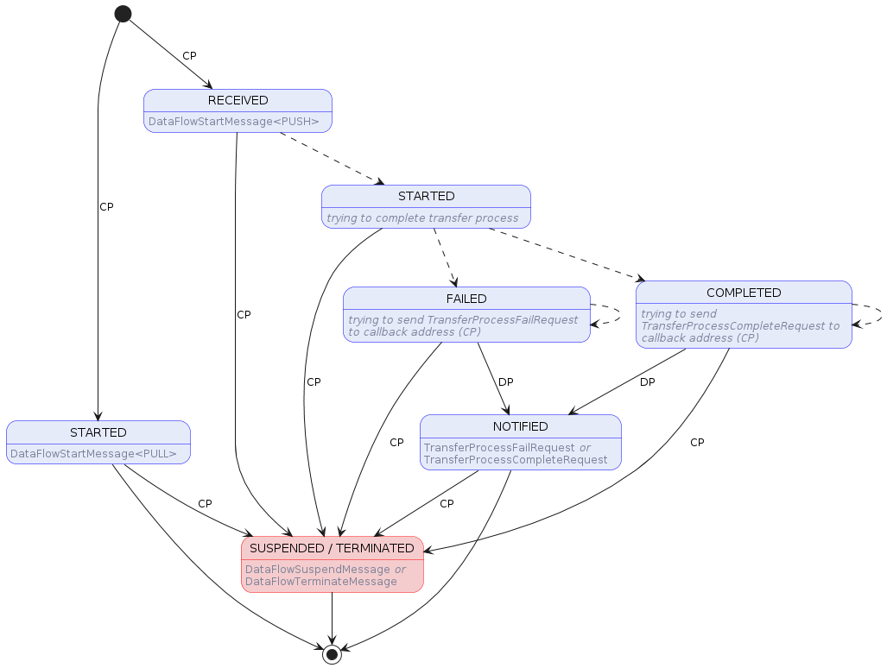
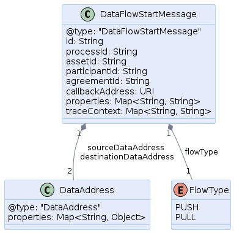
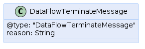
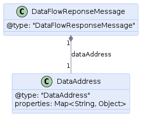
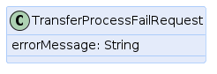

Data Plane Signaling and Access Control Architecture

## I. Introduction

This document defines the data plane signaling and access control architecture. Data plane signaling comprises the protocol messages the control plane uses to communicate with a data plane. Signaling includes data flow initiation, suspension, and termination. Signaling also governs client authorization and access control, namely, when a client attempts to access data via a data plane.

The message interactions defined in this document are intended to serve as a basis for interoperability between the EDC control plane and third-party data plane implementations. The EDC Data Plane Framework (DPF) will also support the signaling and access control protocol. 

### Requirements

1. Data plane authorization must continue to function when the control plane is offline, for example, during a control plane upgrade.
2. A data plane must support a maximum threshold between the time a transfer process is closed and an access to data via the data plane is shut off.
3. Data plane authorization must not place significant load on the control plane.
4. The architecture must support clustered control plane and data plane deployments.

### Principles

#### 1. Contract Agreement

A contract agreement governs 0..N transfer processes. A contract agreement may have multiple associated transfer processes, including N processes in an active state. If a contract agreement is expired, invalid, or otherwise not in force, all associated transfer processes must be transitioned to the `TERMINATED` state. Enforcing this cascading behavior is the responsibility of control plane subsystems, including the policy monitor.

#### 2. Transfer Process

A transfer process governs access to a particular asset. In other words, all data transfers are regulated by an associated transfer process. If a transfer process is transitioned to the `SUSPENDED` or `TERMINATED` state, all associated data access channels must be suspended or closed.

#### 3. Data Address and Endpoint Data Reference

When the control plane signals to the data plane to start a client pull transfer process, the data plane returns a `DataAddress` (provider push transfers do not return a `DataAddress`). This `DataAddress` contains information the client uses to resolve the provider's data plane endpoint. It may also contain a bearer access token. 

This `DataAddress` is returned to the client control plane. If the client control plane is an EDC implementation, the `DataAddress` will be transformed into an `EndpointDataAddress` (EDR) which contains additional metadata associated with the transfer, such as the asset id and contract id. 

Since a transfer process may be `STARTED` multiple times (e.g., after it is temporarily `SUSPENDED`), the client may receive a different `DataAddress` as part of each start message. The client must always create a new `EDR` from these messages and remove the previous `EDR`. Data plane implementations may choose to pass the same `DataAddress` or an updated one. 

Note that start signaling can be used to change a data plane's endpoint address, for example, after an upgrade (in this case the transfer process would transition back into the `STARTED` state).

#### 4.  Access Token Renewal

The data plane access token may be renewable based on the capabilities of its associated data plane. If an access token is renewable, the renew operation must happen out-of-band from the control plane. 

### The Signaling Protocol

All requests must support idempotent behavior. Data planes must therefore perform request de-duplication. After a data plane commits a request, it will return an ack to the control plane, which will transition the `TransferProcess` to its next state. If a successful ack is not received, the control plane will resend the request during a subsequent tick period.

### States

The Data Plane Signaling protocol is represented by the following states:

- **RECEIVED:** The Data Plane received a [DataFlowStartMessage](#DataFlowStartMessage) with a `FlowType` of `PUSH`. It acknowledges receiving the message by responding with a [DataFlowResponseMessage](#DataFlowResponseMessage).
- **STARTED:** In case of a `PULL` transfer, the EDR token was issued and provided to the Control Plane successfully using a [DataFlowResponseMessage](#DataFlowResponseMessage). In case of a `PUSH` transfer, the transfer process was initiated successfully and acknowledged by sending an empty [DataFlowResponseMessage](#DataFlowResponseMessage).
- **COMPLETED:** A `PUSH` transfer was completed successfully. The Data Plane tries to notify the Control Plane about the outcome.
- **FAILED:** The Data Plane failed to complete the transfer process and continuously tries to notify the Control Plane about the issue.
- **NOTIFIED:** The Data Plane successfully notified the Control Plane about the outcome of the transfer, either being a success or failure.
- **SUSPENDED:** The Control Plane sent a [DataFlowSuspendMessage](#DataFlowSuspendMessage) to the Data Plane, thus suspending the transfer process.
- **TERMINATED:** The Control Plane sent a [DataFlowTerminateMessage](#DataFlowTerminateMessage) to the Data Plane, thus terminating the transfer process.

##### State Machine

The Data Plane Signaling state machine can be seen in the following diagram:



### Message Types

The Data Plane Signaling supports the following message types, in order to allow for the Control Plane to fulfill a `TransferProcess` using a suitable Data Plane. A Data Plane gets selected based on their capabilities by a Data Plane Framework Selector. Furthermore, the Control Plane (`DataFlowController`) will record which Data Plane was selected for the transfer process so that it can properly route subsequent, start, stop, and terminate requests.

#### DataFlowStartMessage

| Message Type        | Start                                                                    |
|---------------------|--------------------------------------------------------------------------|
| **Sent by**         | Control Plane                                                            |
| **Resulting state** | `RECEIVED` or `STARTED` dependent on the `FlowType` (Push or Pull)       |
| **Response**        | [DataFlowResponseMessage](#DataFlowResponseMessage)                      |
| **Schema**          | JSON Schema                                                              |
| **Example**         | [DataFlowStartMessage](message-types/examples/DataFlowStartMessage.json) |
| **Diagram(s)**      |                      |

Initiates the data flow by signaling the Data Plane to start the transfer process. Dependent on the `FlowType` the following things will happen:
- `PUSH`: Data Plane acknowledges the request using a [DataFlowResponseMessage](#DataFlowResponseMessage) and tries to start the transfer process. Will notify Control Plane about the respective outcome after either success or failure in a later state.
- `PULL`: Data Plane returns callback address to pull the data from and an access token using a [DataFlowResponseMessage](#DataFlowResponseMessage).

Furthermore, if the data flow was previously `SUSPENDED`, the data plane may elect to return the prior used `DataAddress` or create a new one.

#### DataFlowSuspendMessage

| Message Type        | Suspend                                                                      |
|---------------------|------------------------------------------------------------------------------|
| **Sent by**         | Control Plane                                                                |
| **Resulting state** | `SUSPENDED`                                                                  |
| **Response**        | -                                                                            |
| **Schema**          | JSON Schema                                                                  |
| **Example**         | [DataFlowSuspendMessage](message-types/examples/DataFlowSuspendMessage.json) |
| **Diagram(s)**      |                        |

Leads to the suspension of the data flow, thus stopping it and invalidating the associated access token.

#### DataFlowTerminateMessage

| Message Type        | Terminate                                                                        |
|---------------------|----------------------------------------------------------------------------------|
| **Sent by**         | Control Plane                                                                    |
| **Resulting state** | `TERMINATED`                                                                     |
| **Response**        | -                                                                                |
| **Schema**          | JSON Schema                                                                      |
| **Example**         | [DataFlowTerminateMessage](message-types/examples/DataFlowTerminateMessage.json) |
| **Diagram(s)**      |                          |

Leads to the termination of the data flow, thus stopping it and invalidating the associated access token.

### Response Types

The response messages are either sent as a direct response to an incoming message or as an indirect response at a later stage during the transfer process.

#### DataFlowResponseMessage

| Message Type        | Response                                                                       |
|---------------------|--------------------------------------------------------------------------------|
| **Sent by**         | Data Plane                                                                     |
| **Resulting state** | -                                                                              |
| **Schema**          | JSON Schema                                                                    |
| **Example**         | [DataFlowResponseMessage](message-types/examples/DataFlowResponseMessage.json) |
| **Diagram(s)**      |                         |

This message is a direct response message to a [DataFlowStartMessage](#DataFlowStartMessage) and acknowledges receiving it. Will be used to provide access token and callback address in case of a `PULL` transfer.

#### TransferProcessCompleteRequest

| Message Type        | Notification             |
|---------------------|--------------------------|
| **Sent by**         | Data Plane               |
| **Resulting state** | `NOTIFIED`               |
| **Schema**          | *None due to empty body* |
| **Example**         | -                        |
| **Diagram(s)**      | -                        |

This message is not a direct response to an incoming message. It rather gets sent by the Data Plane if the already started transfer process was successfully completed. Successfully sending this message leads to the transfer state machine to proceed to the state `NOTIFIED` in case of a `PUSH` transfer.

#### TransferProcessFailRequest

| Message Type        | Notification                                                                         |
|---------------------|--------------------------------------------------------------------------------------|
| **Sent by**         | Data Plane                                                                           |
| **Resulting state** | `NOTIFIED`                                                                           |
| **Schema**          | JSON Schema                                                                          |
| **Example**         | [TransferProcessFailRequest](message-types/examples/TransferProcessFailRequest.json) |
| **Diagram(s)**      |                            |

This message is not a direct response to an incoming message. It rather gets sent by the Data Plane if the already started transfer process encountered an error, thus failed to be fulfilled. Successfully sending this message leads to the transfer state machine to proceed to the state `NOTIFIED` in case of a `PUSH` transfer.

## II. Control Plane Refactoring

### 1. DataAddress and Token Generation

Currently, the `ConsumerPullTransferDataFlowController` delegates to the `ConsumerPullDataPlaneProxyResolver` to create a `DataAddress` with an access token. This should be moved to the data plane.

The DPF implementation will use the `TokenGenerationService` to create its access token.

### 2. Signaling Messages

The following messages will be introduced: `DataFlowRequest` renamed to `DataFlowStartMessage`; `DataFlowSuspendMessage`; and `DataFlowTerminateMessage`.

### 3. DataFlowController

The `DataFlowController` interface will be updated to:

- Add a new `suspend` method:
```java
StatusResult<Void> suspend(TransferProcess transferProcess);
```
- Rename the `initiateFlow` method:
```java
 StatusResult<DataFlowResponse> start(TransferProcess transferProcess, Policy policy);
```

### `ConsumerPullTransferDataFlowController` and `ConsumerPushTransferDataFlowController` 

When a data plane is selected, the data plane id (from `DataPlaneInstance`) will be persisted with the `TransferProcess`. This will enable consistent routing of messages to the same data plane.

#### 3. DataFlowManager

The `DataFlow` manager will be updated to reflect the `DataFlowController` methods. 

## III. DPF Design

This section covers specific architectural details concerning the runtime operation of the EDC Data Plane Framework. Other data plane implementations may behave differently. 

### Access Control 

The design of the EDC Data Plane Framework is based on non-renewable access tokens. One access token will be maintained for the period a transfer process is in the `STARTED` state. This duration may be a single request or a series of requests spanning an indefinite period of time.

Other data plane implementations my chose to support renewable tokens. Token renewal is often used as a strategy for controlling access duration and mitigating leaked tokens. The EDC implementation will handle access duration and mitigate against leaked tokens in the following ways.

#### Access Duration

Access duration is controlled by the transfer process and contract agreement, not the token. If a transfer processes is moved from the `STARTED` to the `SUSPENDED`, `TERMINATED`, or `COMPLETED` state, the access token will no longer be valid. Similarly, if a contract agreement is violated or otherwise invalidated, a cascade operation will terminate all associated transfer processes.   

#### Leaked Access Tokens

If an access token is leaked, its associated transfer process must be placed in the `TERMINATED` state and a new one started. In order to mitigate the possibility of ongoing data access when a leak is not discovered, a data plane may implement token renewal. Limited-duration contract agreements and transfer processes may also be used. For example, a transfer process could be terminated after a period of time by the provider and the consumer can initiate a new process before or after that period. 

### Data Flow Management and Access Token Generation

The DPF will persistently manage push and pull `DataRequests,` whereas it previously only persisted push requests:

- The SUSPENDED state will be added to `DataFlowStates.`
- `DataAddress` and access token creation will be moved from control plane to the data plane. The data plane framework will create an access token containing a cryptographically secure UUID and the dat flow id. The access token UUID will be stored with the DataFlow instance.
- During deduplication, the DPF will recreate the `DataAddress` and access token. This will avoid storing access tokens on the provider. Any tokens from previous requests will be invalidated. In other words, the last token wins.

### Runtime Access Checks

During bootstrap, the DPF will initialize a cache of active `DataFlow` id-token id pairs that are in the `STARTED` state.  The cache will be updated on `DataFlow` state changes. 

When a request for data is made by a client, the provided access token will be validated and its associated data flow id will checked against the cache. If an entry is not found, or the token id does not match, the request will be denied.

## Appendix: Additional Refactoring

- Remove `NOT_TRACKED` from `DataFlowStates`
- Consider renaming `DataFlowManager` to `DataFlowService`
