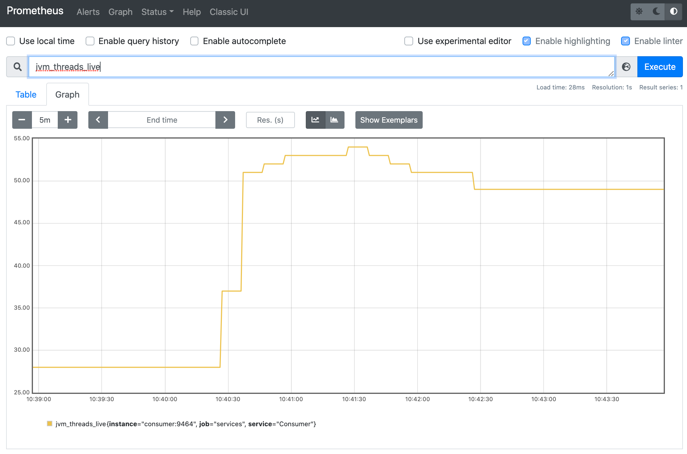
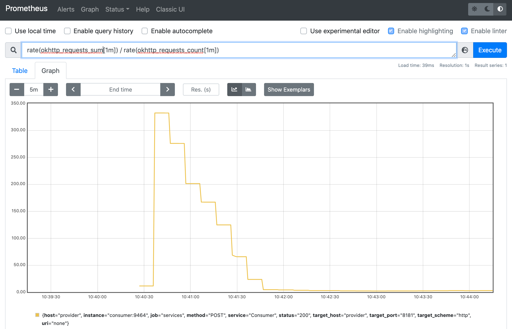
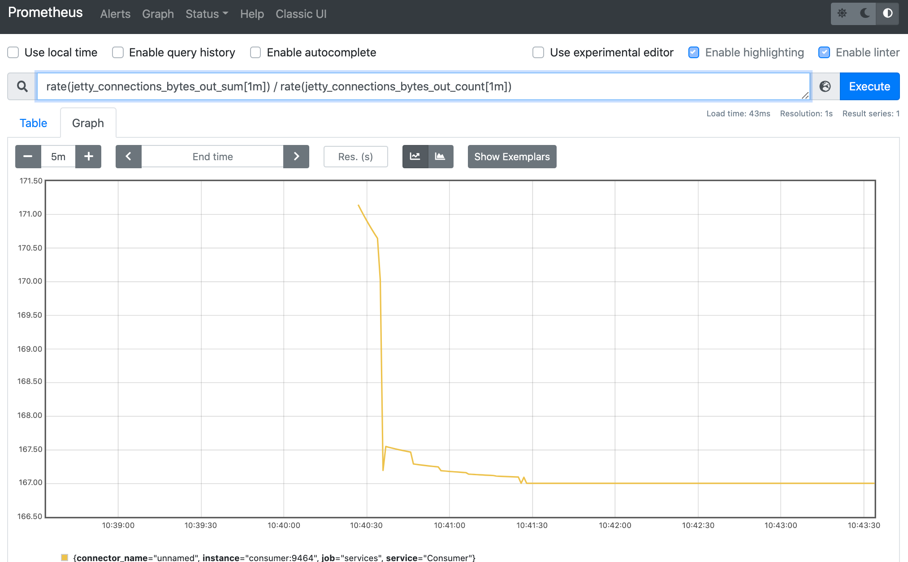
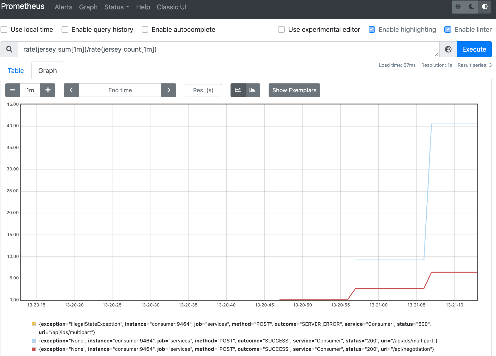
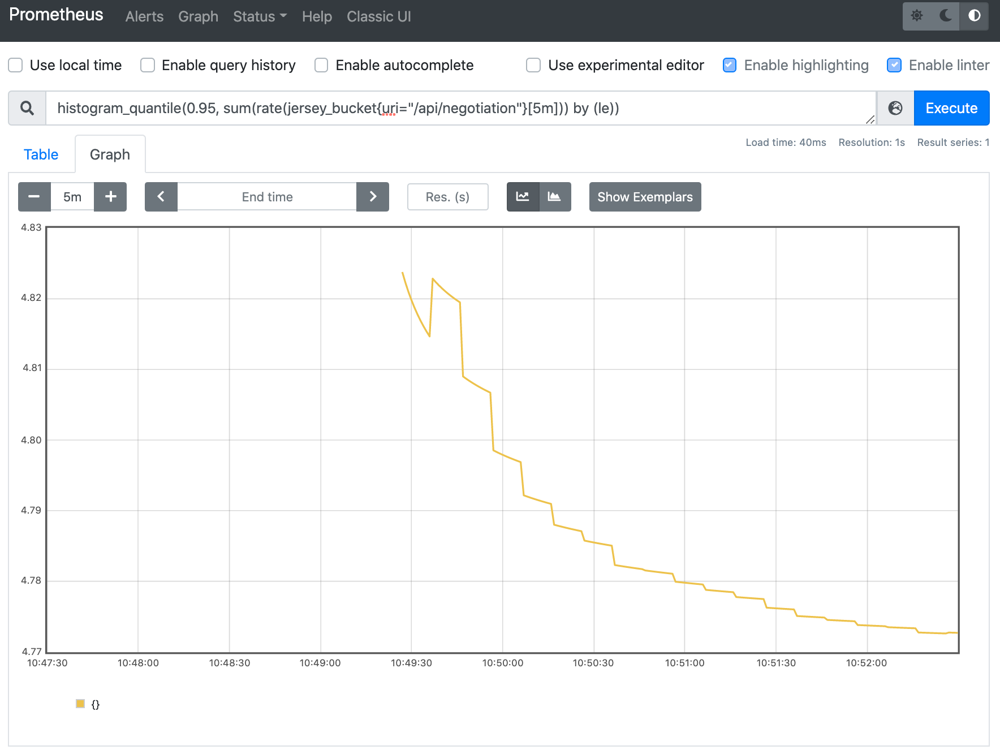

# Micrometer metrics

## Decision

Use the [Micrometer](https://micrometer.io/) metrics library to automatically collect metrics from the host system, JVM, and frameworks and libraries used in EDC (including OkHttp, Jetty and Jersey). This enables users to integrate with most observability stacks in the market.

Micrometer dependencies are not introduced in core. Middleware and callbacks are used to optionally import dedicated monitoring modules in the runtime.

Metrics instrumentation is optional and can be disabled globally or for specific modules via runtime settings.

**Note:** This decision record only deals with *automatically collected metrics*. *Custom metrics* will be addressed in further work.

**Note:** The basic functionality in the EDC [IoC](https://en.wikipedia.org/wiki/Inversion_of_control) container does not allow proper decoupling of Micrometer listener from factory logic. Therefore, it is currently necessary to write Micrometer binding code directly in factory classes (for example, the class that sets up the Jetty server).

## Rationale

Capturing key system metrics, especially on I/O interfaces, is essential to system observability. Micrometer is a mature framework for collecting metrics, is well supported by vendors of metrics collector products, and can directly integrate with the popular open-source libraries used in EDC.

The [OpenTelemetry Metrics](https://opentelemetry.io/docs/reference/specification/metrics/) library standard was also considered, but it is currently experimental and still lacks broad vendor and library support. It is likely to catch up in the medium-term future, at which point Micrometer might be swapped.

The [OpenTelemetry agent](https://github.com/open-telemetry/opentelemetry-java-instrumentation/blob/main/docs/supported-libraries.md#libraries--frameworks) already supports collecting metrics from Micrometer, and [exposing them](https://github.com/open-telemetry/opentelemetry-java/blob/main/sdk-extensions/autoconfigure/README.md) to a Prometheus endpoint. Prometheus is a widely used open source standard for exposing application metrics via an HTTP endpoint. On Azure, the [Application Insights agent](https://docs.microsoft.com/azure/azure-monitor/app/java-in-process-agent) natively forwards metrics from Micrometer to Azure Application Insights.

## Spike

We built a [spike](https://github.com/eclipse-dataspaceconnector/DataSpaceConnector/compare/main...agera-edc:spike/419/7-micrometer-metrics?expand=1) in a repository fork. The spike configures Micrometer to collect metrics in multiple ways.

### Micrometer registry

We use the [global Micrometer registry](https://micrometer.io/docs/concepts#_global_registry) to enable [Application Insights agent](https://docs.microsoft.com/azure/azure-monitor/app/java-in-process-agent) integration. The registry does not require any configuration.

### Prometheus

In our spike, we created [a sample 04.3](https://github.com/agera-edc/DataSpaceConnector/tree/spike/419/7-micrometer-metrics/samples/04.3-open-telemetry) to deploy an open-source Prometheus server:

```yaml
  prometheus:
    image: prom/prometheus:v2.30.3
    container_name: prometheus
    volumes:
      - ./prometheus/:/etc/prometheus/
    ports:
      - 9090:9090
```

The server is the available at [http://localhost:9090](http://localhost:9090).

We added an environment variable for the OpenTelemetry agent to automatically expose a Prometheus endpoint on default port 9464.

```yaml
 # Env var for consumer and producer
 OTEL_METRICS_EXPORTER: prometheus
```

We created a suitable file at `prometheus/prometheus.yml` for the Prometheus server to scrape those endpoints.

```yaml
global:
  scrape_interval: 10s
  scrape_timeout: 10s

scrape_configs:
  - job_name: services
    static_configs:
      - targets:
          - 'consumer:9464'
        labels:
          service: 'Consumer'
      - targets:
          - 'provider:9464'
        labels:
          service: 'Provider'
```

### Collecting System and JVM metrics

At startup, we run the following code:

```java
        new ClassLoaderMetrics().bindTo(registry);
        new JvmMemoryMetrics().bindTo(registry);
        new JvmGcMetrics().bindTo(registry);
        new ProcessorMetrics().bindTo(registry);
        new JvmThreadMetrics().bindTo(registry);
```

This tracks among others the number of live threads:



### Collecting OkHttp metrics

OkHttp is an HTTP client library used in EDC to perform outgoing REST calls. Micrometer [natively integrates with OkHttp](https://micrometer.io/docs/ref/okhttpclient).

An `OkHttpClient` instance is globally confirmed in the `:core:base` module. We instrument the client with a metrics listener:

```java
 OkHttpClient client = new OkHttpClient.Builder()
                .eventListener(OkHttpMetricsEventListener.builder(registry, "okhttp.requests").build())
```

This yields count and duration histogram metrics, tagged by target URL.



### Collecting Jetty metrics

Jetty is the HTTP server and servlet container used in EDC to expose HTTP endpoints. [Micrometer natively integrates with Jetty](https://github.com/micrometer-metrics/micrometer/tree/main/micrometer-core/src/main/java/io/micrometer/core/instrument/binder/jetty), although the integration is not documented. We referred to [Spring Boot code](https://github.com/spring-projects/spring-boot/blob/ce6b12a02480f77ead612834123ba640509649c9/spring-boot-project/spring-boot-actuator/src/main/java/org/springframework/boot/actuate/metrics/web/jetty/JettyConnectionMetricsBinder.java#L49) to understand how to achieve integration:

```java
JettyConnectionMetrics.addToAllConnectors(server, registry);
```

This yields the count of connections, as well as counters and histograms of inbound and outbound bytes:



### Jersey

Jersey is the REST framework used in EDC to provide JAX-RS (JSR-370) endpoints (REST Controllers). [Micrometer natively integrates with Jersey](https://github.com/micrometer-metrics/micrometer/tree/main/micrometer-core/src/main/java/io/micrometer/core/instrument/binder/jersey/server) although the integration is not documented. We also referred to [Spring Boot code](https://github.com/spring-projects/spring-boot/blob/d336a96b7f204a398b8237560c5dfa7095c53460/spring-boot-project/spring-boot-actuator-autoconfigure/src/main/java/org/springframework/boot/actuate/autoconfigure/metrics/jersey/JerseyServerMetricsAutoConfiguration.java#L81) to understand how to achieve integration:

```java
            resourceConfig.register(new MetricsApplicationEventListener(
                    registry,
                    new DefaultJerseyTagsProvider(),
                    /* metricName = */ "jersey",
                    /* autoTimeRequests = */ true));
```

This yields count and duration histogram metrics, tagged by REST service as well as result status and exception thrown, if any.



The sample query below tracks a particular duration [histogram quantile](https://prometheus.io/docs/practices/histograms/#quantiles). In this instance, 95% of queries to the `/api/negotiation` endpoint are served in under ~4.8 milliseconds.



### ExecutorService

Micrometer can [automatically monitor `ExecutorService`](https://github.com/micrometer-metrics/micrometer/blob/708c62def62c477700a22e15145be689af95fbdb/micrometer-core/src/main/java/io/micrometer/core/instrument/binder/jvm/ExecutorServiceMetrics.java) and report of number of idle and active threads,  queued tasks etc. That will be particularly useful when managing thread pools for parallel data transfers.
