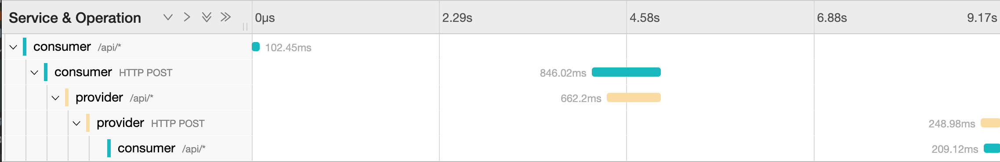
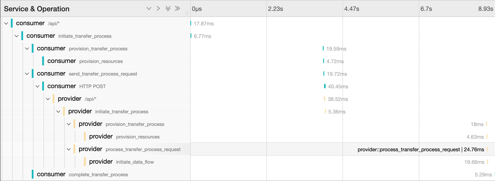

# Tracing 

## Decision

Use [OpenTelemetry](https://opentelemetry.io/) to enable distributed tracing in EDC. 

[Context propagation](https://opentelemetry.io/docs/instrumentation/java/manual/#context-propagation) needs to be implemented accordingly so that traces are propagated across asynchronous workers. Business entities processed by async workers are used as carriers of tracing information, which is persisted together with the rest of the entity.

## Rationale

Distributed tracing is an essential observability pillar to correlate requests as they propagate through distributed cloud environments and services. EDC as a framework needs to support distributed tracing in any possible constellation where it might come to use. 

OpenTelemetry provides a vendor-agnostic solution that can be configured to send telemetry data to the backend(s) of choice, including a variety of popular open-source projects. OpenTelemetry instrumentation with Java uses a Java agent that dynamically injects bytecode to capture telemetry from many popular libraries and frameworks automatically. It can be used to capture telemetry data at the “edges” of an app or service, such as inbound requests, outbound HTTP calls, database calls, and so on. This makes it a very compelling option for EDC. 

## Custom Spans

In addition to the spans created by OpenTelemetry's [automatic instrumentation](https://opentelemetry.io/docs/instrumentation/java/automatic/), additional custom spans have been created using the [WithSpan](https://github.com/open-telemetry/opentelemetry-java-instrumentation/blob/main/docs/manual-instrumentation.md#creating-spans-around-methods-with-withspan) annotation in several parts of the EDC codebase.

The general rule of the thumb is to create additional custom spans for operations relevant for tracing, normally involving some kind of I/O and/or communication between components, plus additional core operations that need to be tracked. For EDC we recommend creating custom spans for the following operations:

- Consumer-provider connector communication (methods called by REST handlers)
- State handling methods (methods called by the ContractNegotiation and TransferProcess state machine)
- Resource provisioning and deprovisioning
- TransferProcess data flows
- Database operations

### Span naming

Although custom spans can be given a specific name, we suggest using default span names to avoid duplication. Good method naming will automatically lead to good span naming as this will be used as default, together with the class name (e.g. `ProvisionManagerImpl.provision`)

## Sample traces with Jaeger

The following two samples were created by running the scenario presented in [sample 04.3](../../../../samples/04.3-open-telemetry) using the Jaeger backend. Note how traces include communication between consumer and provider due to a proper trace context propagation.

### Contract Negotiation Trace

### Transfer Process Trace

