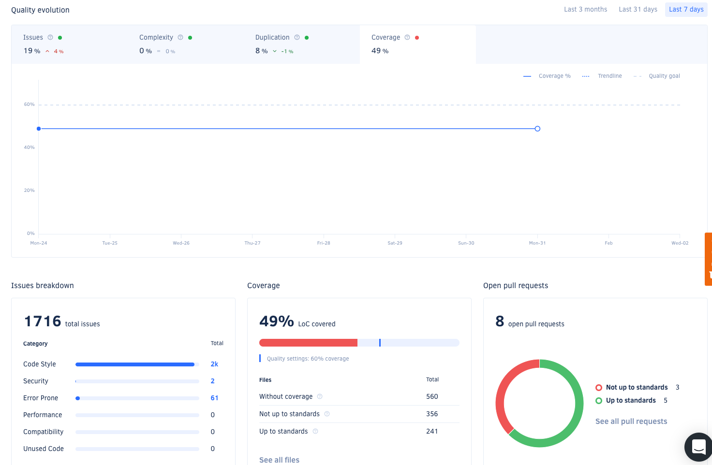

# JaCoCo with Codacy

[Codacy](https://www.codacy.com/) is an online service for both static code analysis and test code coverage analysis. It is free for Open Source projects.

We [enrolled our repository fork](https://docs.codacy.com/getting-started/codacy-quickstart/) into Codacy using its Web UI, and obtained a [Project API token](https://docs.codacy.com/codacy-api/api-tokens/) which we set up as a GitHub secret.

We used the modified `build.gradle.kts` file as above to create JaCoCo XML reports. We then used the [Codacy GitHub action](https://github.com/codacy/codacy-coverage-reporter-action) to upload our reports. The `find ` command is set up to exclude one XML report with empty content that is 240 bytes long, and causes the following action to fail.

```yaml
       - name: Set Coverage Report Paths
         id: coverage-paths
         run: |
           echo -n "::set-output name=COVERAGE_REPORT_PATHS::"
           find . -name jacocoTestReport.xml -size +300c -printf '%p,'
           
       - name: Publish Code Coverage Results
         uses: codacy/codacy-coverage-reporter-action@v1
         with:
           project-token: ${{ secrets.CODACY_PROJECT_TOKEN }}
           coverage-reports: ${{ steps.coverage-paths.outputs.COVERAGE_REPORT_PATHS }}
```
At first the reports weren't visible in the [Codacy UI](https://app.codacy.com/gh/Agera-CatenaX/EclipseDataSpaceConnector/settings/coverage), but they
started to appear after ~16 hours.

In the meantime we also reached out to Codacy support to investigate the issue.

Below screenshot shows code coverage diagram of the main branch analysis.


We didn't manage to set up Codacy to see the code coverage reports for the PRs neither in the Codacy dashboard nor in Github Actions.
Codacy seems to offer more features for code quality analysis than for code coverage scans. 