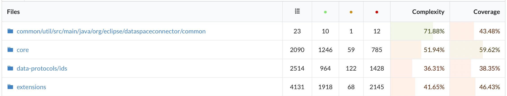
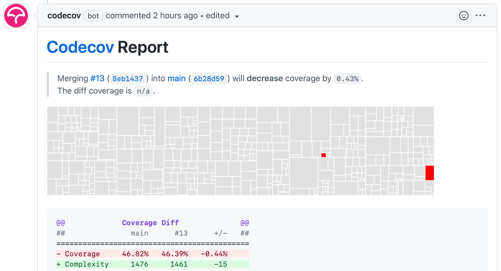
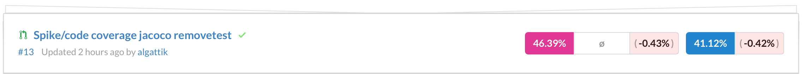
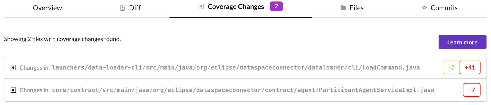
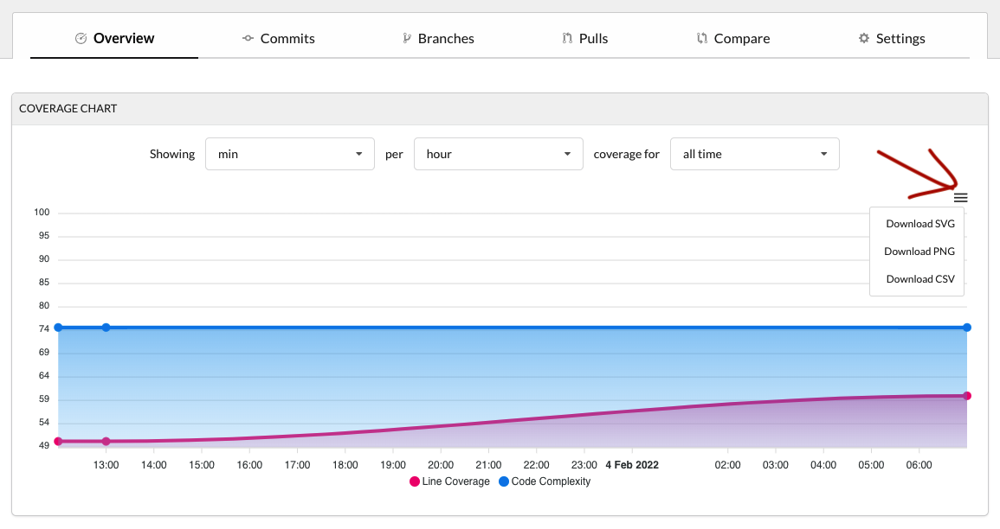

# JaCoCo with Codecov

## Evaluation 

Codecov is an online service for code coverage analysis that promises to "always be free for open source projects". We have been widely using it in various (open-source and proprietary) projects for years with good results.

We modified the root `build.gradle.kts` file to apply the JaCoCo plugin to all projects, and produce an XML format report that can be used by Codecov:

```kotlin
// build.gradle.kts

allprojects {
     //...
     apply(plugin = "jacoco")
     
     //...
     tasks.jacocoTestReport {
         reports {
             xml.required.set(true)
         }
     }
}

```

We modified the `.github/workflows/verify.yaml` workflow as follows:

```yaml
      - name: Gradle Test Core
         run: ./gradlew clean check jacocoTestReport

       - name: CodeCov
         uses: codecov/codecov-action@v2
         with:
           token: ${{ secrets.CODECOV_TOKEN }}
```

The token is supposedly not required for open-source projects, but we got an error running the action without providing a token.

By logging in at https://about.codecov.io with our GitHub Account, we were able to browse straight away to our EDC (fork) repository and obtain a token for the repository. We added the token as a GitHub secret.

We merged a PR with the action configuration above into the `main` (default) branch of our fork repository, for Codecov to report code coverage differences in PRs.

Finally, we installed the Codecov GitHub app into the repository, to enable the Codecov bot to post comments directly into PRs.

The Codecov online site provides detailed coverage reports. These reports also measure cyclomatic complexity.



In PRs, the Codecov bot automatically posts a report indicating coverage changes.



These reports can also be accessed from the Codecov online service.



The report can be drilled to highlight the code subjected to coverage changes.



The configuration of Codecov can be adjusted in a [`codecov.yaml` configuration file](https://docs.codecov.com/docs/codecov-yaml). That allows for example configuration to ensure each new PR [does not decrease coverage](https://docs.codecov.com/docs/common-recipe-list#increase-overall-coverage-on-each-pull-request).

## Using Codecov with forks

Further tests showed that if Codecov is installed in the base repository then providing the Codecov token is indeed not required for open source projects:

```yaml
       - name: CodeCov
         uses: codecov/codecov-action@v2
```

The Codecov PR reports are available with no additional changes also for PRs between forks and the base repository.

If the owners of a fork repository want to use Codecov also for internal PRs (before merging to upstream) then Codecov App needs to be installed also in the
fork, but in this case we also got the reports without providing the token. 

## Codecov reports

We can download a report containing the data from (max) last 6 months about Line and Complexity Coverage from the Codecov dashboard. 
The coverage on the chart can be aggregated per day, hour, month and commit.



Codecov only shows commits that have uploaded coverage reports and are six months or less old ([Codecov doc](https://docs.codecov.com/docs/frequently-asked-questions#where-are-my-older-commits-my-project-dashboard-doesnt-show-any-commit-data-in-the-line-graph)).

## Useful links

- [How to interpret Codecov graphs](https://docs.codecov.com/docs/graphs)
- [How to interpret delta in Codecov reports](https://docs.codecov.com/docs/codecov-delta)
- [More information about Codecov Pull Request comments](https://docs.codecov.com/docs/pull-request-comments)

