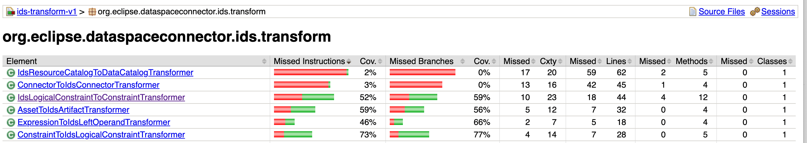
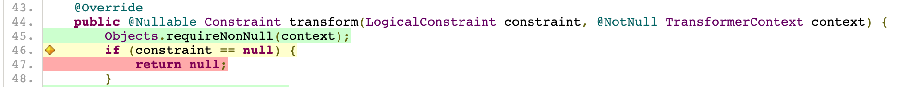

# Option 1: JaCoCo

JaCoCo (Java Code Coverage) is a popular and mature open-source tool. It runs as a Java agent during test execution, to capture which lines are exercised during which test.

Capturing coverage for a particular project in JaCoCo is straightforward, using the [Gradle JaCoCo Plugin](https://docs.gradle.org/current/userguide/jacoco_plugin.html).

```kotlin
// build.gradle.kts
plugins {
    jacoco
}
```

This yields an HTML report.



The report can be drilled to highlight covered lines (green), not covered lines (red), and lines where some execution branches are not covered (orange).



This configuration has limited value since each project produces its own report. Furthermore, there is no indication of whether a given commit is increasing or decreasing coverage, and in which areas of the code.

# Option 2: JaCoCo with aggregation

The Gradle documentation includes a sample for [Reporting code coverage across multiple sub-projects with JaCoCo](https://docs.gradle.org/current/samples/sample_jvm_multi_project_with_code_coverage.html). The sample explains how to generate a single aggregated report.

We were not able to get the sample working in the EDC repository.

In any case, extensive complex Kotlin code needs to be added to the build. This is concerning for maintainability.

As it would anyway not solve the problem that code coverage is best analyzed relatively to a previous commit, we did not attempt further to get the sample working.
