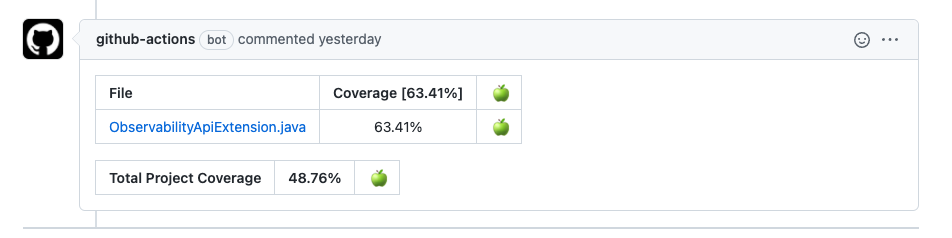

# JaCoCo with Github Action

Code coverage coming from JaCoCo reports can be added to a PR using [Github Action JaCoCo Report](https://github.com/marketplace/actions/jacoco-report).

```yaml
- name: Set Coverage Report Paths
    id: coverage-paths
    run: |
      echo -n "::set-output name=COVERAGE_REPORT_PATHS::$(find ~+ -name jacocoTestReport.xml -size +300c -printf '%p,' | sed 's/.$//')"

- name: Add coverage to PR
    id: jacoco
    uses: madrapps/jacoco-report@v1.2
    with:
      paths: ${{ steps.coverage-paths.outputs.COVERAGE_REPORT_PATHS }} # Comma separated absolute paths of the generated jacoco xml files
      token: ${{ secrets.GITHUB_TOKEN }} # Github personal token to add commits to Pull Request
      min-coverage-overall: 40 # The minimum code coverage that is required to pass for overall project
      min-coverage-changed-files: 60 #The minimum code coverage that is required to pass for changed files
```
The above workflow will send a comment to the PR showing the code coverage of the files modified in the PR and the overall project code coverage.

