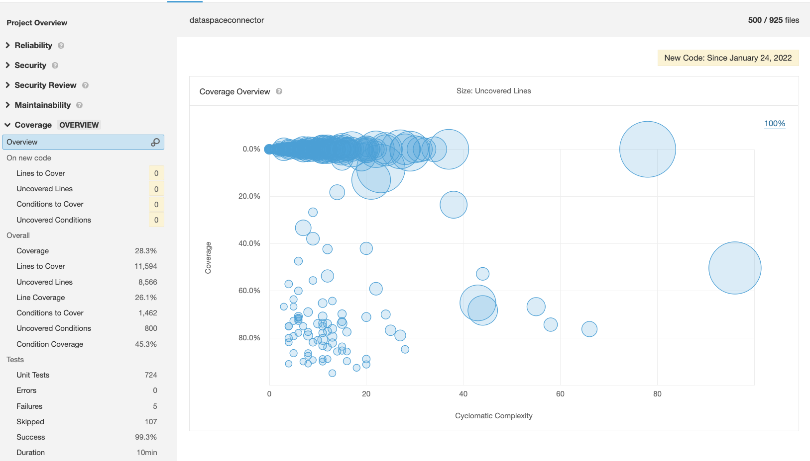

# JaCoCo with SonarQube

[SonarQube](https://docs.sonarqube.org/latest/setup/get-started-2-minutes/) is a platform for both static code analysis and test code coverage analysis. It offers an open source Community
Edition version, which is free but has some limitations.

SonarQube can be run locally by adding a SonarQube plugin to gradle and e.g. running SonarQube instance from docker.

Add Gradle plugin:

```gradle
plugin {
    id("org.sonarqube") version "3.3"
}
```

To enable code coverage reports test coverage reports should be generated (explained in sections: Option 1 and Option 2).

Docker-compose file with minimal configuration:

```yml
version: "3"
services:
  sonarqube:
    image: sonarqube:lts
    ports:
      - 9000:9000
    environment:
      - SONAR_FORCEAUTHENTICATION=false
```

Then when sonar is up current project can be added to the analysis by running a command:

```bash
./gradlew sonarqube
```

Above mentioned configuration works when SonarQube is running on default url: http://localhost:9000 and jacoco reports are placed in default location.
Otherwise these properties should be set: _sonar.host.url_, _sonar.jacoco.reportPaths_. Here can be found more information about [sonarqube Gradle plugin](https://docs.sonarqube.org/latest/analysis/scan/sonarscanner-for-gradle/).

Code coverage analysis with SonarQube:



## Integration with Github Actions

Integration with github Actions wasn't a part of this spike, because it requires having a SonarQube instance deployed for the whole project, instead of using
localhost version.

More information about [Github Integration](https://docs.sonarqube.org/latest/analysis/github-integration/).

[Github Action that helps to run the code analysis.](https://github.com/marketplace/actions/official-sonarqube-scan)

## Limitations of the Community Edition version

- Analysis of multiple branches is not supported
- Reporting measures to branches and pull requests in Github not supported
- Automatic detection of branches/pull requests in Github Actions not supported