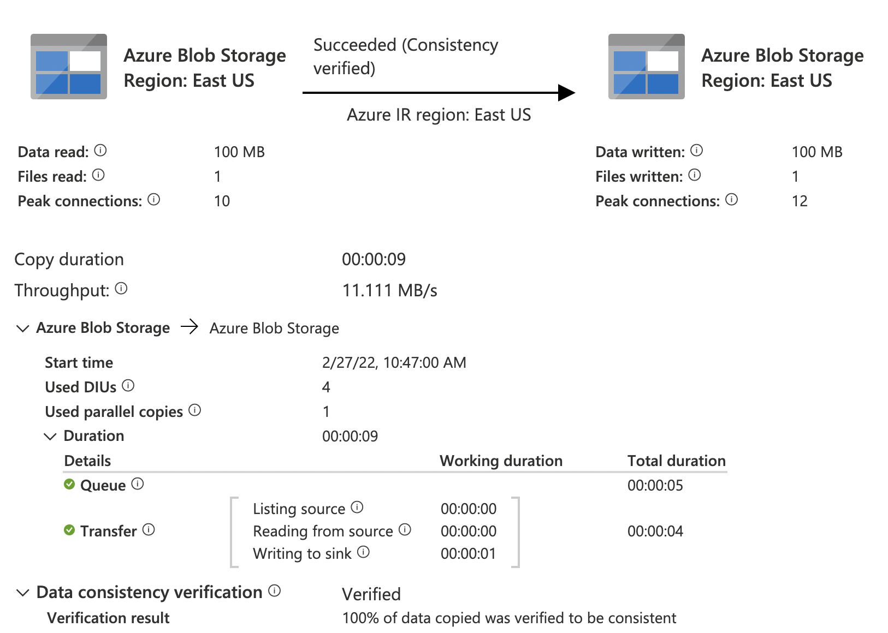

# Serverless transfers in DPF

## Decision

Serverless mechanisms for data transfers are supported in DPF. Examples of serverless implementations include Azure Data Factory, a fully managed integration service that can be controlled through a REST API.
The Data Plane Framework uses a routing mechanism to either manage data transfer by itself (using pluggable sources and sinks), or delegate transfer to a pluggable service such as an extension for performing transfers with Azure Data Factory.

## Rationale

Serverless data transfer infrastructure is provided by major cloud providers and integration software vendors. For example, Azure Data Factory (ADF) offers a serverless way to copy data at scale in an optimised manner. As a managed service, it offers increased scalability and reduced operational load on the application when copying data.

Serverless offerings cannot replace DPF stream-based copy, since EDC users may not want a vendor dependency, and each serverless product supports a limited range of integrations. Serverless transfer can, however, be an optional module in DPF. DataFlowRequests can be routed to either serverless transfer or DPF source/sink streams, depending on rules to be defined, such as whether the serverless platform supports the source and sink, as well as transfer size.

Taking the example of Azure Data Factory, advantages of mature serverless integration platforms include:

- Optionally deploy Integration Runtime to access data within enterprise virtual network (or on-premises data).
- High scalability and parallelism.
- Optimized copy e.g. for blobs.
- Built-in reliability mechanisms, checksumming, retry, monitoring.
- 80+ connectors, for example S3, Azure storage.
- Flexible handling of many scenarios. For example, when copying from storage accounts, wildcards and hierarchy flattening.
- Data transformation - not in scope at the moment, in the future we may want to land the data in the format the consumer requests it, such as Parquet for analytical applications.
- Cost aligned to usage without overprovisioning.

Limitations of serverless integration include:

- Complexity and additional failure point of adding an additional component.
- Latency. As of February 2022, the [SLA for Data Factory](https://azure.microsoft.com/en-us/support/legal/sla/data-factory/v1_2/) provides a 99.9% guarantee that activities start in less than 4 minutes. Though in practice, in our tests, runs started within a few seconds, the possible impact on end-to-end latency must be accounted for.
- Cost may be variable and less predictable, which may complicate budgeting.

DPF cannot perform all data transfers in serverless platforms. It therefore needs a routing mechanism to perform data transfers with streams, or delegate them to the serverless platform. Besides the obvious scenario of a source or sink type that the platform does not support, DPF could use various approaches for this routing:

- Request-based: the DataFlowRequest could contain attributes indicating which approach is preferred. An interactive application which transfers small payloads would favor low latency and benefit little from the high scalability of serverless platforms. By setting relevant attributes in the request, it could signal DPF to favour not using a serverless platform in this case.
- Rule-based: DPF could estimate the size of the transfer, and perform "small" transfers using streams, and delegate "large" transfers to serverless platforms. Other drivers could be system load and network bandwidth use.

A related topic is routing among several serverless platforms, if several are enabled on an EDC deployment. However, in practice EDC users will probably integrate with the native offering of their cloud provider, so this can be dealt later as needed.

## Spike

We built a [spike](https://github.com/agera-edc/DataSpaceConnector/pull/112) in a forked repository to showcase the simplest possible use of ADF, to copy data between two storage accounts.

### Structure

- The DPF server code was modified to add an extension that routes data flow requests to ADF if the source and the destination are both Azure Blob storage (this is illustrative, as ADF would also allow other types of source and destination).
- An Azure Key Vault (AKV) is deployed in the provider's domain to manage transient secrets including the storage account key for both source and destination storage accounts, which are passed within the data flow request.
- An Azure Data Factory instance is deployed in the provider's domain, with read access to Azure Key Vault secrets.

The DPF extension for ADF provisions, for each transfer request:

- Two AKV secrets, one for each of the source and destination storage account key (as passed in the data flow request).
- Two ADF linked services, one for each of the source and destination storage accounts. Each linked service is linked to the corresponding AKV secret.
- Two ADF datasets, one for each of the source and destination. Each dataset is linked to the corresponding linked service.
- One ADF pipeline, containing a single activity to copy data from source to destination. The activity is linked to both datasets.
- One ADF pipeline run.

The pipeline run is asynchronous, and the DPF extension should use a state machine to regularly poll for completion. In the spike, for simplicity, we implemented busy polling to provide a synchronous implementation.

When using Data Factory Studio, note that pipelines created through the REST API do not appear in the pipeline designer (for manual editing). However, the runs of those pipelines do appear in the Monitor tab.

### Walkthrough

The DPF `PipelineService` is responsible for looking up source and sink stream implementation and using them to effect a transfer. That service was extended to pass the request to a `AzureDataFactoryTransferService` if the source and destination are both blobs. This implementation violates Single Responsibility Possibility for the sake of simplicity in the spike.

The `AzureDataFactoryTransferService` uses the Azure Resource Manager SDK using a service principal. This requires the`AZURE_TENANT_ID`, `AZURE_SUBSCRIPTION_ID`,  `AZURE_CLIENT_ID` and`AZURE_CLIENT_SECRET` environment variables to be set.

The `AzureDataFactoryTransferService` provisions the AKV secrets and ADF pipeline, and then waits for the pipeline to enter a terminal state.

### Results

The implementation of a DPF transfer was straightforward using the ADF SDK. Run details are available using a UI. In this test run, a 100 MiB blob was copied in 9 seconds with 10 resp. 12 parallel connections on the source and destinations, and the data was verified using checksums.



### Deployment

Run the following script to deploy Azure resources. Resource names can be adapted by editing the script.

```bash
docs/developer/decision-records/2022-03-01-serverless-transfers/create-resources-and-run-server.sh
```

Once the DPF server is running, all resources have been deployed.

You can then run integration test `org.eclipse.dataspaceconnector.azure.dataplane.azurestorage.AzureDataFactoryCopyIntegrationTest`.

In Azure portal, navigate to the data factory instance and open Data Factory Studio. In the Monitor tab, you can view details for the run.

You can also use DPF server that is run by the script, to start a transfer between any storage accounts with curl or Postman.

```bash
curl http://localhost:8181/control/transfer -H "Content-Type: application/json" --data '{
    "id": "9033DE3C-711A-4803-8AB8-489AC795D82D",
    "edctype": "dataspaceconnector:dataflowrequest",
    "processId": "1647468C-2A0F-4DB1-B45C-08DB3EAF7AD9",
    "sourceDataAddress": {
        "properties": {
            "account": "<ACCOUNTNAME>",
            "type": "AzureStorageBlobData",
            "container": "<CONTAINERNAME>",
            "blob": "<BLOBNAME>",
            "sharedKey": "<SHAREDKEY>"
        }
    },
    "destinationDataAddress": {
        "properties": {
            "account": "<ACCOUNTNAME>",
            "type": "AzureStorageBlobData",
            "container": "<CONTAINERNAME>",
            "sharedKey": "<SHAREDKEY>"
        }
    }
}'

```
