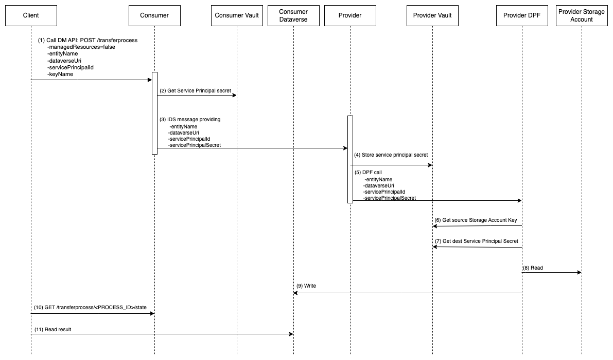

## Dataverse Authentication

There are three kinds of [authentication types](https://learn.microsoft.com/en-us/azure/data-factory/connector-dynamics-crm-office-365?tabs=data-factory#dynamics-365-and-dynamics-crm-online):
- AADServicePrincipal
- Office365: username, password
- ManagedIdentity

We use Azure AD Service Principal to authenticate Dataverse, similar to how Blob uses SAS (write-only SAS, with a 1-hour validity and limited access to only one container).

With the service principal, we can limit the secret's expiration to only one hour and grant the least privilege necessary, such as read-write permission on the destination Table.

Using the service principal secret, the provider can write data to the consumer's Table.

## Managed resources

We support managedResources as `false`.

In the case of Blob to Blob, only managedResources as `true` is supported, as a new container and a SAS will be created each time.

In the case of Dataverse, it is hard to create a Entity(Table) on demand because the entities have different schemas. So we use pre-existing entity and service principal.

