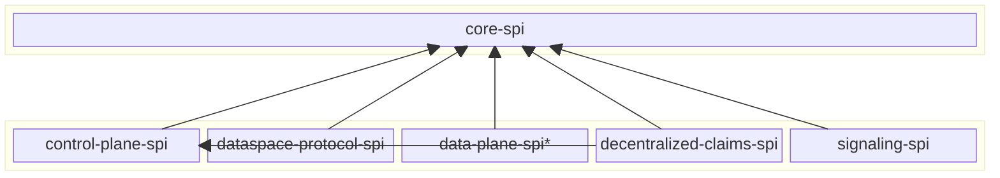

# SPI Module Consolidation

## Decision

We will consolidate the ~45 SPI modules currently under `spi/` into a small set of coarse-grained, layer-oriented
modules. The target structure is:

- `core-spi` — everything needed to build a _runtime_, but not necessarily a _connector_ (boot, web/http, json-ld,
  transactions, tokens/keys, base participant context, identity primitives).
- `control-plane-spi` — everything needed to build a _connector_ runtime, including all control-plane domain types and
  stores.
- `data-plane-spi` — everything needed to build a _data plane_ runtime (pipeline, source/sink, manager, registry).
- One SPI module per protocol: `decentralized-claims-spi` (Decentralized Claims Protocol), `signaling-spi` (Dataplane Signaling) and
  `dataspace-protocol-spi` (DSP binding).

We accept that this removes published Maven coordinates and is therefore a breaking change for downstream adopters that
depend on the individual modules directly.

## Rationale

The `spi/` tree has grown to ~45 modules, many of which are tiny (several contain a single interface or a handful of
constants) and exist only because of historically fine-grained packaging. The granularity no longer carries its weight:

- It imposes a high cognitive and maintenance cost (build files, dependency wiring, autodoc, publishing) for modules
  that are always pulled in together.
- The boundaries do not map cleanly to the way the SPIs are actually consumed. There are essentially four audiences:
  runtime builders, connector (control-plane) builders, data-plane builders, and protocol implementors. The current
  module list does not reflect those audiences.
- Publishing modules takes around **2:45 hours** now, which is in part attributable to the large number of modules:
  every module is published individually to Maven Central.

Collapsing the modules along the lines of these four audiences gives consumers a small, predictable set of dependencies
and reduces the number of modules we publish and maintain, without losing any meaningful separation of concerns: the
resulting modules still form a clean, acyclic dependency layering.

## Approach

### Target modules and mapping

Every module currently under `spi/` is assigned to exactly one target module.

**`core-spi`** — generic runtime primitives, no connector/control-plane domain, intended for building runtimes, such as
REST APIs:

```
boot-spi  core-spi  http-spi  web-spi  json-ld-spi  transform-spi  validator-spi
transaction-spi  transaction-datasource-spi  policy-model  token-spi  jwt-spi  keys-spi
encryption-spi  oauth2-spi  auth-spi  connector-participant-context-spi
identity-did-spi  verifiable-credentials-spi  vault-hashicorp-spi 
```

**`control-plane-spi`** — connector domain types and stores:

```
control-plane-spi  asset-spi  catalog-spi  contract-spi  transfer-spi  policy-spi
policy-engine-spi  participant-spi  request-policy-context-spi  cel-spi
participant-context-single-spi  participant-context-config-spi  secrets-spi
edr-store-spi  task-spi  policy-monitor-spi  data-plane-selector-spi federated-catalog-spi  crawler-spi
```

**`data-plane-spi`** — data-plane runtime framework (deprecated, scheduled for removal):

```
data-plane-spi  data-plane-http-spi
```

**`decentralized-claims-spi`** — Decentralized Claims Protocol / identity:

```
decentralized-claims-spi
```

**`dataspace-protocol-spi`** — DSP binding (profile context, protocol versions, webhooks, discovery):

```
protocol-spi
```

**`signaling-spi`** — Dataplane Signaling protocol + types + model classes:

```
signaling-spi
```

Note that this is not an exhaustive list of SPI modules. There are several others that will be relocated/merged to fit
the pattern established here.

### Resulting layering

The target modules form an acyclic layering. `core-spi` is the base; `control-plane-spi`, `data-plane-spi` and the
protocol modules build on top of it (the federated-catalog and crawler SPIs are folded into `control-plane-spi`). One
protocol module, `decentralized-claims-spi`, additionally depends on `control-plane-spi`, because it reuses
`policy-engine-spi` and `participant-spi` for credential-scope policy evaluation, and those now live in
`control-plane-spi`.



*) deprecated

The single upward edge from a protocol module — `decentralized-claims-spi → control-plane-spi` — is a deliberate trade-off: keeping the
policy and participant SPIs out of `core-spi` (because they are not generic to every runtime) means the
credential-scope policy types that `decentralized-claims-spi` reuses now sit in `control-plane-spi`.

During refactoring we may find edge cases that don't really fit anywhere. Unless there is a strong reason against it,
those edge cases should collectively go into `core-spi`.

### Open points

A few assignments are deliberate judgment calls and can be revisited:

- `data-plane-spi` as a separate module. The data-plane framework SPI is large and domain-specific, and it is deprecated.
  This will make deletion easier once the DPF is removed altogether.
- `oauth2-spi` is placed in `core-spi` as a token primitive; alternatively, it could become its own (centralized)
  identity-protocol module alongside `decentralized-claims-spi`.
- `auth-spi` (Management API authentication) is placed in `core-spi` as generic web-API auth, but we may need to split
  it and move some parts into `control-plane-spi`, because some interfaces and model classes are specific to the
  Management API, e.g. `ManagementApiScopes` and `ParticipantPrincipal`
- `participant-context` is split: `connector-participant-context-spi` stays in `core-spi`, since non-connector
  runtimes (e.g. identity hubs) also need it, while the `participant-context-single-spi` and
  `participant-context-config-spi` variants are connector-runtime concerns and go into `control-plane-spi`.

  
