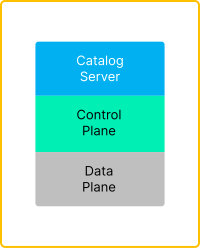
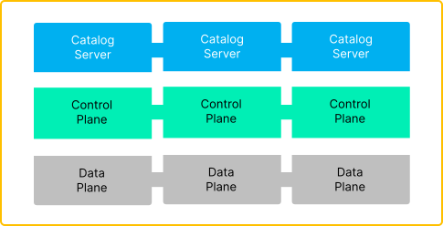
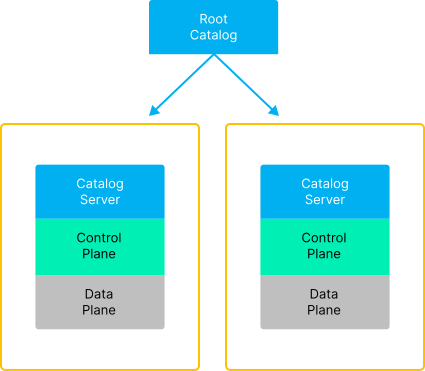
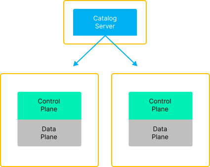

This document introduces the concept of a ***management domain*** and the changes necessary to implement support for it
in EDC runtimes. Management domains enable a dataspace participant to delegate operational responsibility of EDC
components throughout an organization. For example, organizational subdivisions may elect to manage data sharing
completely independently or delegate some responsibilities such as operating data planes to other units. The changes
required to support these advanced topologies are minimal.

A ***management domain*** is defined as:

> A realm of control over a set of EDC components

EDC components are runtimes that may be deployed across multiple processes or collocated within a single process. The
following are examples of EDC components:

- Catalog Server
- Control Plane
- Data Plane
- Identity Hub

The current document will outline how management domains operate for three EDC components: the Catalog Server, Control
Plane, and Data Plane.

## 1. Topologies

Management domains may be constructed to support the following deployment topologies.

### Type 1: Single Management Domain

A single management domain deploys EDC components under one unified operations setup. In this topology, EDC components
may be deployed to a single, collocated process (management domains are represented by the yellow bounding box):



*Type 1: One management domain controlling a single instance*

More complex operational environments may deploy EDC components as separate clustered instances under the operational
control of a single management domain. For example, a Kubernetes cluster could be deployed with separate *ReplicateSets*
running pods of Catalog Servers, Control Planes, and Data Planes:



*Type 1: One management domain controlling a cluster of individual ReplicaSets*

### Type 2: Distributed Management Domains

Single management domain topologies are not practical in organizations with independent subdivisions. Often, each
subdivision is responsible for all or part of the data-sharing process. To accommodate these use cases, EDC components
deployed to separate operational contexts (and hence separate management domains) must function together.

Consider the example of a large multinational conglomerate, Foo Industries, which supplies parts for widget production.
Foo Industries has separate geographic divisions for production. Each division is responsible for sharing its supply
chain data with Foo's partners as part of the Widget-X Dataspace. Foo Industries participates under a single corporate
identity in the dataspace, in this case using the Web DID `did:web:widget-x.foo.com`. Some partners may have access to
only one of Foo's divisions.

Foo can support this scenario by adopting a ***distributed management domain topology***. There are several different
ways to distribute management domains.

#### Type 2 A: Root Catalog with a Single EDC Stack

Let's take the simplest to start: each division deploys its own EDC component stack. Externally, Foo Industries presents
a unified DSP Catalog obtained by resolving the catalog endpoint from Foo's Web DID, `did:web:widget-x.foo.com`. The
returned catalog will contain entries for the Foo divisions a client has access to (the mechanics of how this is done
are explained below). To support this setup, Foo could deploy the following management domains:



*Type2 A: Distributed Management Domains containing an EDC stack*

Here, two primary management domains contain a full EDC stack. A root catalog (explained below) serves as the main entry
point for client requests.

#### Type 2B: Catalog Server and Control/Data Plane Runtime

Foo Industries could also choose to deploy EDC components themselves in separate management domains. For example, a
central catalog server that fronts two management domains consisting of Control/Data Plane runtimes:


*Type2 B: Distributed Management Domains containing a Catalog Server and separate Control/Data Plane runtimes*

#### Type 2C: Catalog Server/Control Plane with Data Plane Runtime

Or, Foo Industries could elect to run a centralized Catalog Server/Control Plane:



*Type2 C: Distributed Management Domains containing a Catalog Server/Control Plane and separate Data Plane runtimes*

## 2. Architecture

The EDC will take advantage of the `Catalog` type specified
in [DCAT 3](https://www.w3.org/TR/vocab-dcat-3/#Class:Catalog) Specifically, `Catalog` is a subtype of a `Dataset`,
which allows the EDC to introduce the concept of `Assets` that represent remote catalogs. At the `DSP` layer,
a `Catalog` may contain other `Catalogs,` thereby forming a composition:

```json
{
  "@context": "https://w3id.org/dspace/v0.8/context.json",
  "@id": "urn:uuid:3afeadd8-ed2d-569e-d634-8394a8836d57",
  "@type": "dcat:Catalog",
  "dct:title": "Data Provider Root Catalog",
  "dct:description": [
    "A catalog of catalogs"
  ],
  "dct:publisher": "Data Provider A",
  "dcat:catalog": {
    "@type": "dcat:Catalog",
    "dct:publisher": "Data Provider A",
    "dcat:distribution": {
      "@type": "dcat:Distribution",
      "dcat:accessService": "urn:uuid:4aa2dcc8-4d2d-569e-d634-8394a8834d77"
    },
    "dcat:service": [
      {
        "@id": "urn:uuid:4aa2dcc8-4d2d-569e-d634-8394a8834d77",
        "@type": "dcat:DataService",
        "dcat:endpointURL": "https://provder-a.com/subcatalog"
      }
    ]
  }
}
```

Sub-catalogs are linked using DCAT `Services`, which can be used to create a navigable web of hyperlinks.
The [Type 2A topology](#type-2-a-root-catalog-with-a-single-edc-stack) can be supported using either a static document
served by an HTTP server such nginx or an EDC Catalog Server.

The `EDC` will use a specialization of `Asset` (note this is not a Java subtype of `Asset`) to represent a contained
catalog. The specialization will be noted using the Json-Ld `@type` attribute of `dcat:Catalog` when an `Asset` is
created via the Management API. The associated  `DataAddress` must contain the publicly accessible sub-catalog endpoint.

### 2.1. Access Control

Returning to the previous example, Foo Industries has a requirement to limit access to subdivision data based on client
credentials. This can be achieved using the [Type 2B topology](#type-2b-catalog-server-and-controldata-plane-runtime)
Since sub-catalogs are derived from EDC `Assets`, access policy can be attached using a `ContractDefinition`. When
handling a client request, the EDC Catalog Server will evaluate the access policy against the client's credentials as
the root catalog is generated.

### 2.2. Remote Data Plane Registration

Foo Industries could elect to host a centralized control plane with distributed data planes as defined
by [Type 2C topologies](#type-2c-catalog-servercontrol-plane-with-data-plane-runtime). Note that remote data plane
registration is already supported.

### 2.3. Zero Replication

The current design explicitly eschews replication for performance and simplicity. Composite catalogs use hyperlinks,
which can be navigated lazily by an asynchronous crawler. To facilitate performant access to assets contained in
sub-catalogs, the EDC Federated Catalog Crawler will be enhanced and packaged with the EDC to support composite catalog
caching. The Management API will delegate to this local cache before forwarding remote calls.

It is also important to note that contract negotiation and transfer process metadata is not replicated across management
domains. In other words, each management domain is responsible for handling contract negotiation and the transfer
process lifecycle independently. This is easily accommodated by DSP's (and by extension DCAT's design), which relies
on `Distributions` to convey contract negotiation and transfer process endpoints. If an organization requires
cross-division visibility of contract agreements, a custom read-only replication mechanism can be built as an EDC
extension using the current event listener mechanism.

## 3. Implementation

The following implementation work will be done to support Management Domains.

### 3.1. `Asset` and `Dataset` Specialization

The following changes will be made:

- A boolean subtype field will be introduced on `Asset` to indicate if it is a catalog. This field will be set to `true`
  when an optional `@type` property is set to `dcat:Catalog` when an asset is created in the Management API.
- The Management API will be updated in a backward-compatible way to handle optionally specifying the `@type` property
  on `Asset`.
- `Catalog` will extend `Dataset`.
- `DatasetResolverImpl` will be refactored to handle `Asset` catalog subtypes and return a `Catalog` with the
  appropriate `distribution` and `service` properties derived from the contained `DataAddress`. Note that identifiers
  should be deterministically generated.
- `JsonObjectFromDatasetTransformer` service will be refactored to delegate serialization of `Catalog` subtypes.

### 3.2. Federated Catalog Crawler

The Federated Catalog Crawler (FCC) will be refactored to navigate and cache composite catalogs. Configuration to
control recursion depth should be available. Note that care must be taken to ensure stable query results are returned
from a local cache while the FCC is in the process of updating entries for a participant. Specifically, updates should
be done atomically per participant so that intermediate results are not returned for a query.

The FCC will be further refactored so that it can be included as an optional service in control plane runtimes.

### 3.3. Management API

The Management API will be refactored to query the local FCC cache when handling a catalog request. If entries are not
found, the request will be forwarded to the remote endpoint.

### 3.4. Catalog Server

Testing and refactoring will be done to ensure the Catalog Server can be deployed as a separate runtime process.
