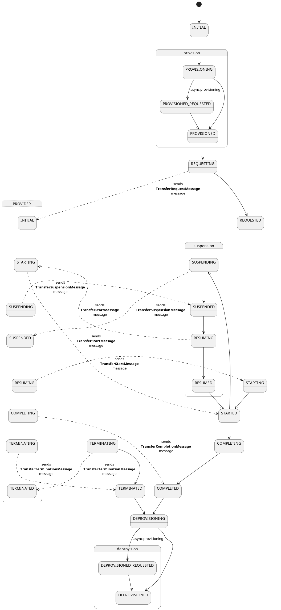
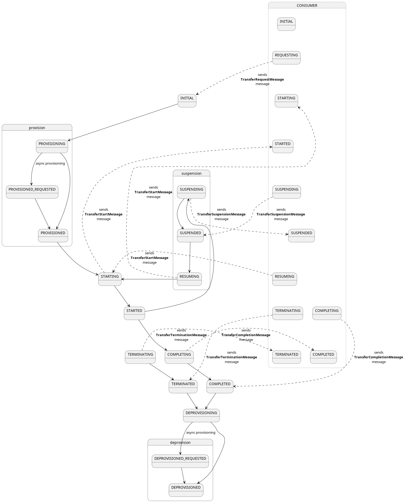

# Transfer Process

## Data Flows Supported by the EDC

- Consumer pull
- Provider push

### Consumer pull

1. Provider and consumer agree to a contract (not displayed in the diagram)
2. Consumer initiates the transfer process by sending a `DataRequest` with destination type `HttpProxy`
3. Provider Data Plane Selector is queried to find a suitable instance
4. Provider Control Plane build a `DataAddress` which type `EDR`, whose:
    - endpoint corresponds to the public API of the selected Data Plane
    - auth key is `Authorization`
    - auth code is a signed token generated by the Control Plane with claims:
    - `dad` containing the encrypted `DataAddress` of the actual data source (provider ecosystem)
    - `cid` claim containing the contract id
5. This `DataAddress` is sent to the consumer Control Plane through DSP protocol
6. Consumer Control Plane converts the `DataAddress` into a `EndpointDataReference` object and dispatch it through the `EndpointDataReferenceReceiverRegistry`

Once this process is completed, the consumer backend applications can use the received `EndpointDataReference` in order
to query data from the provider Data Plane, by simply providing the provided token in the request header.

> **_NOTE:_**  For a Data Plane instance to be eligible for the Consumer Pull transfer, it must:
>  - contains `HttpProxy` in the `allowedDestTypes`
>  - contain a `property` which key `publicApiUrl`, which contains the actual URL of the Data Plane public API.

### Provider push

1. Provider and consumer agree to a contract (not displayed in the diagram)
2. Consumer initiates the transfer process, i.e. sends `DataRequest` with any destination type other than `HttpProxy`
3. Provider Control Plane retrieves the `DataAddress` of the actual data source and creates a `DataFlowRequest` based on the received `DataRequest` and this data address
4. Provider Control Plane asks the selector which Data Plane instance can be used for this data transfer
5. Selector returns an eligible Data Plane instance (if any)
6. Provider Control Plane sends the `DataFlowRequest` to the selected Data Plane instance through its control API (see `DataPlaneControlApi`)
7. Provider Data Plane validates the incoming request
8. If request is valid, Provider Data Plane returns acknowledgement
9. `DataPlaneManager` of the Provider Data Plane processes the request: it creates a `DataSource`/`DataSink` pair based on the source/destination data addresses
10. Provider Data Plane fetches data from the actual data source (see `DataSource`)
11. Provider Data Plane pushes data to the consumer services (see `DataSink`)

## Transfer Process State Machine

### Consumer

### Provider

