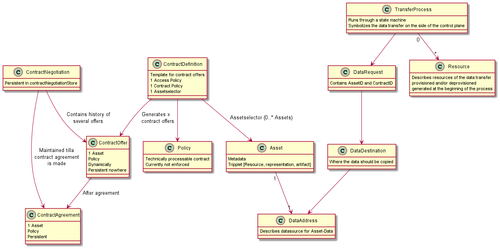

# Domain Model

> The shown picture illustrates only a generic view of the Domain Model and is not intended to show all aspects of the project.

## Asset

An asset is represented by the data (databases, files, cache information, etc.) to be published and shared between
organizations. For each asset a [Data address](#data-address) needs to be resolvable.

## Data address

Pointer into the physical storage location where an asset will be stored

## Contract

A contract always contains one or more [Assets](#asset) and a single [Policy](#policy). The contract construct is used
to define the arrangement between two parties ("consumer" and "provider"). Regarding this arrangement, the contract
passes several stages which are explained below:

* ### Contract definition

  Contract definitions associate a policy with assets. A ContractDefinition object contains access policies, contract
  policies, and an asset selector which links the contract to one or more assets.

* ### Contract offer

  The contract offer is a dynamic representation of the [contract definition](#contract-definition)
  for a specific consumer and serves as protocol DTO for a particular contract negotiation. These contract offers are
  not persisted and will be regenerated on every request. The provider connector will only generate contract offers for
  those contract definitions where the inquiring organizations satisfy the policies established in the contract
  definitions access policy. A contract offer is always related to a single asset of the contract definition (e. g. a
  for `ContractDefinition` containing three `Asset`s the provider will generate three `ContractOffer`s ).

* ### Contract negotiation

  A contract negotiation captures the current state of the negotiation of a contract (ContractOffer ->
  ContractAgreement) between two parties. This process is inherently asynchronous, so the ContractNegotiation objects
  are stored in a backing data store (ContractNegotiationStore).

* ### Contract agreement

  Represents the agreed-upon terms of usage of an asset between two parties including a start and an end date.

## Policy

Contract policies represent permitted and prohibited actions over a certain asset. These actions can be limited further
by constraints (temporal or spatial) and duties ("e.g. deletion of the data after 30 days"). Further information is
provided in a separate [section](Policies.md).

## Data request

A `DataRequest` is sent from the consumer to the provider after a successful contract negotiation to initiate the data
transfer. It references the [asset](#asset) and [contract](#contract-agreement) as well as information about
the [data destination](#data-address).

## Transfer process

Analogous to the ContractNegotiation this object captures the current state of a data transfer. This process is
inherently asynchronous, so the TransferProcess objects are stored in a backing data store (TransferProcessStore).