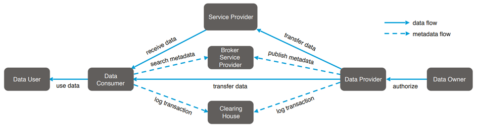

# Domain Model
---

## Definitions:

### EDC connector

 EDC is an interoperable, cross-organization framework for data sharing between 2 or more Organizations in a trusted and
compliant way. This framework has focused to develop in 4 key technological key points for safer data sharing: Identity
of the user(s), Trust, Policies and Interoperability. The Eclipse Dataspace Connector framework provides different
modules for performing data queries, exchanges, policy enforcement, monitoring and auditing.

Before deepening into EDC complex structure and extensions, it is important to define some concepts in order to make
this document clearer.

#### 1. What does a connector really do?

 The connector is a framework for sovereign, inter-organizational data exchange and contains the technology component that allows each organization involved in the exchange to define how digital processes, infrastructures, and data flows are structured, built, and managed to ensure adherence to corporate policies and data sovereignty regulations1

A connector is composed of 2 subsystems:

| **Control Plane (First checking step)** | **Data Plane (Second checking step)** |
|:----------------------------------------|:--------------------------------------|
| User verification (access to data)      | Moves bits.                           |
| Contract negotiation.                   | Big Data Tasks.                       |
| Overseeing of Policy enforcement.       | Streaming.                            |
| Provisioning management.                | Events.                               |

 The connector processes requests asynchronously, which are useful for example in case one has to deal with lengthy data preparation

#### 2. Definitions related to the EDC Connector

 When publishing and accessing to data in a dataspace, it is necessary to have at least 2 different components: One to publish or make data available, and another one which can access to that data. For this case, we will call them provider and consumer. 

* **Data Provider**:

  
 The Data Provider makes data available for being exchanged between a Data Owner and a Data Consumer. The Data Provider
  may log the details of the successful (or unsuccessful) completion of the transaction at a Clearing House (
  intermediary that provides clearing and settlement services for all financial and data exchange transactions) to
  facilitate billing or resolve a conflict. Furthermore, the Data Provider can use Data Apps to enrich or transform the
  data in some way, or to improve its quality (Data Apps are specific applications that can be integrated into the data
  exchange workflow between two or more participants in the Industrial Data Space)2 The data owner can also be the data
  provider, when it is not, then a contract is needed between the client and provider in order to start a transfer of
  data. 

* **Data consumer**:

  
The Data Consumer receives data from a Data Provider. Before the connection to a Data Provider can be established, the
  Data Consumer can search for existing datasets by making an inquiry at a Broker Service Provider (provides the required
  metadata for the Data Consumer to connect to a Data Provider.). Alternatively (In case the information to connect with
  the Data Provider is already known to the Data Consumer), the Data Consumer can establish a connection with a Data
  Provider directly2 The data user, can also be the data consumer.

The following definitions are used in the terminology for the domain model.

#### Asset:

The data (Databases, Files, Cache Information, etc) to be published and shared between organizations is represented as
an asset. Every asset owns its [Data address](#data-address).

#### Data Address:

Description of the location where the asset data is or will be located.

#### Contract:

A contract always contains one or more [Assets](#asset), one or more [Policies](#policy). The contract construct is used
to define the arrangement between two parties (consumer and provider). Regarding this arrangement, the contract passes
several stages which are explained in the following:

* #### Contract Definition:

  contract definition is a top-down design that associates policies with assets. This contract definition contains
  access policies, contract policies, and an asset selector which links the contract to one or more assets. Access
  policies are non-public requirements for accessing the contract offers. Contract policies are also requirements for
  accessing the contract offers. In addition, the consumer must follow these policies when accessing the assets.

* #### Contract Offer

  The contract offer is a dynamic representation of the [contract definition](#contract-definition)
  for a specific consumer and will be used for the contract negotiation. This contract offers are not persistent and
  will be regenerated on every request. The provider EDC will only generate contract offers for the contract definitions
  where the inquiring organizations privileges satisfy the policies established in the contract definitions access
  policy. One contract offer is always related to only one asset of the contract definition (e. g. if the contract
  definition is related to 3 assets, the consumer will get 3 separate contract offers). In addition, the contract offer
  contains a policy which is the contract policy.

* #### Contract Negotiation

  Is the process when an organization, represented with a connector as a consumer, asks for access to a certain asset
  and supplies all the requirements specified in the contract offer. Some states of the contract negotiation are the
  requesting of an asset, the offers asked in the negotiation, the approval or the declining of it.

* #### Contract Agreement

  agreed usage between data provider and data consumer after a contract negotiation. It points to a contract offer and
  can have expiry or cancellation date.

#### Policy:

[policy]: Contract policies represent permitted and prohibited actions over a certain asset. These actions can be
limited further by constraints (temporal or spatial) and duties (e. g. deletion of the data after 30 days). Further
information is provided in a separate [section](Policies.md).

#### Data Request:

Data Request is a representation which creation initialize the data [transfer process](#transfer-process) on the
consumer side. It contains a reference of the to be transferred [Asset](#asset) and
the [Contract (Agreement)](#contract-agreement).

#### Transfer process:

Representation of the data transfer. Runs through a state machine which defines certain states like provisioning,
transferring, completed.

## Domain model

## References

1. https://projects.eclipse.org/projects/technology.dsconnector/reviews/creation-review
2. https://www.fraunhofer.de/content/dam/zv/de/Forschungsfelder/industrial-data-space/IDS_Referenz_Architecture.pdf