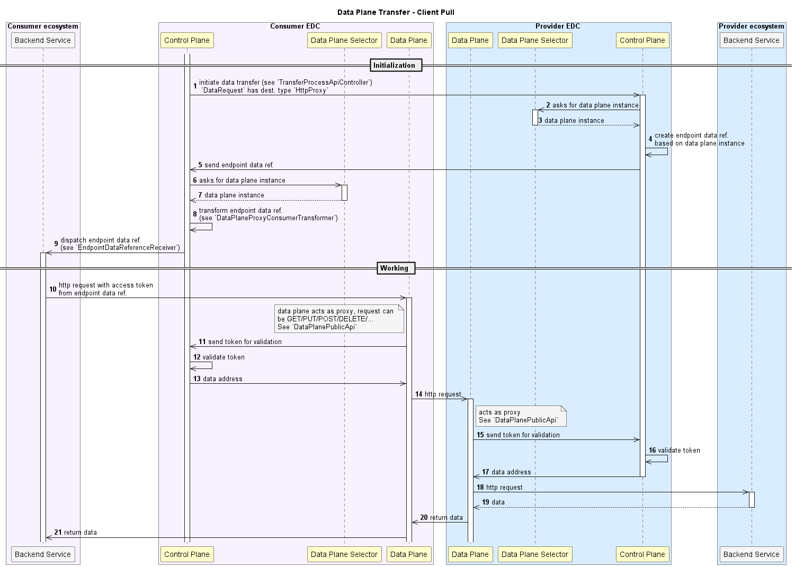

# Data Plane Transfer

This extension provides services for delegating data transfer to the Data Plane. Especially two types of data transfers are supported:

- Consumer Pull: data consumer pulls actively the data by hitting an endpoint exposed by the provider. This use-case is typically
  used in cases where the data provider wants to use its Data Plane as a http proxy to an internal backend API which serves data.
- Provider Push: if data request is successfully processed, then the provider pushes data from its data source to the provider.

## Background

The Data Plane is the component performing the actual data exchange between the provider and the consumer. Once an agreement
is established between the consumer and the provider, then the consumer can trigger the data request that will initiate the data exchange.
When at this stage, the present extension is used for delegating the data transfer to the appropriate Data Plane instance.

### Scope

This extension is to be used for every data transfer use-case relying on the EDC data plane.

### Use Cases

#### Consumer pull

Let us consider that a data provider wants to expose a REST API serving flight schedule data. This REST API takes in input
a set of query parameters which enables to restrict the amount of data returned in the response, e.g. departure date, boarding airport...
A consumer of this API will potentially be interested in hitting this API several times, potentially with different parameters, depending
on how the consumer backend application are exploiting the data.

For this use-case, the Provider Push data transfer type would not be relevant, as it would require to establish a new contract before
the consumer send a new http request, which would potentially overload the Control Plane. The Consumer Pull data transfer comes handy in that case.

To trigger this data transfer type, the destination type of the `DataRequest` must be set to `HttpProxy`.

#### Provider push

A consumer wants to perform a one-time transfer of a large amount of data stored in a S3 bucket on provider side, and
put these data into its Azure Blob Storage.

## Technical Details

### Interfaces

This extension introduces a Control Plane endpoint used by the Data Plane for validating the access token received in input
of its public API. OpenApi documentation can be found [here](../../../resources/openapi/yaml/data-plane-transfer.yaml).

### Configurations

| Parameter name                                      | Description                                                                                    | Mandatory   | Default value         |
|:----------------------------------------------------|:-----------------------------------------------------------------------------------------------|:------------|:----------------------|
| `edc.transfer.proxy.token.validity.seconds`         | Validity (in seconds) of tokens generated by the extension for accessing Data Plane public API | false       | 600                   | 
| `edc.transfer.client.selector.strategy`             | Strategy for Data Plane instance selection                                                     | false       | random                |
| `edc.transfer.proxy.token.signer.privatekey.alias`  | Alias of private key used for signing tokens                                                   | false       | Random EC public key  |
| `edc.transfer.proxy.token.verifier.publickey.alias` | Alias of public key used for verifying the tokens                                              | false       | Random EC private key |

## Terminology

## Design Principles

### Consumer pull

0. Provider and consumer agree to a contract (not displayed in the diagram)
1. Consumer initiates the transfer process, i.e. sends `DataRequest` with destination type equals to `HttpProxy`
2. Provider Control Plane asks to the selector which Data Plane instance can be used for this data transfer
3. Selector returns an eligible Data Plane instance (if any)
4. Provider Control Plane generates an `EndpointDataReference` with a signed token composed of:
    - a `dad` claim containing the encrypted `DataAddress` of the actual data source (provider ecosystem)
    - a `cid` claim containing the contract id
5. `EndpointDataReference` is sent to the consumer Control Plane (IDS protocol)
6. Consumer Control Plane asks to the selector which Data Plane instance can be used for this data transfer
7. Selector returns an eligible Data Plane instance (if any)
8. Transform the `EndpointDataReference` into another with a signed token composed of:
    - a `dad` claim containing the encrypted `DataAddress` to the Provider Data Plane, i.e. a `HttpDataAddress` whose url is the public API of the Provider Data Plane.
    - a `cid` claim containing the contract id
9. Dispatch the resulting `EndpointDataReference` to the appropriate backend services (consumer ecosystem), see `EndpointDataReferenceReceiver`
10. Consumer backend services hit the Consumer Data Plane public API with any verb (GET, POST, DELETE...) and pass the token of the `EndpointDataReference` as input
11. Consumer Data Plane sends the token to its Control Plane for validation
12. Consumer Control Plane validates the token, check if contract is still valid and, if yes, decrypt the `DataAddress`
13. Consumer Control Plane returns the decrypted data address to the Data Plane
14. Consumer Data Plane forwards the data request to the Provider Data Plane public API
15. Consumer Data Plane sends the token to its Control Plane for validation
16. Provider Control Plane validates the token, check if contract is still valid and, if yes, decrypt the `DataAddress`
17. Provider Control Plane returns the decrypted data address to the Data Plane
18. Provider Data Plane forward data request to the backend services
19. Backend services return data to Provider Data Plane
20. Provider Data Plane returns data to Consumer Data Plane
21. Consumer Data Plane returns data to the Consumer backend services

> **_NOTE:_**  For a Data Plane instance to be eligible for the transfer, it must:
>  - contains `HttpProxy` in the `allowedDestTypes`
>  - contain a `property` which key `publicApiUrl`, which contains the actual URL of the Data Plane public API.

### Provider push

0. Provider and consumer agree to a contract (not displayed in the diagram)
1. Consumer initiates the transfer process, i.e. sends `DataRequest` with any destination type other than `HttpProxy`
2. Provider Control Plane retrieves the `DataAddress` of the actual data source and creates a `DataFlowRequest` based on the received `DataRequest` and this data address
3. Provider Control Plane asks to the selector which Data Plane instance can be used for this data transfer
4. Selector returns an eligible Data Plane instance (if any)
5. Provider Control Plane sends the `DataFlowRequest` to the selected Data Plane instance through its control API (see `DataPlaneControlApi`)
6. Provider Data Plane validates the incoming request
7. If request is valid, Provider Data Plane returns acknowledgement
8. `DataPlaneManager` of the Provider Data Plane processes the request: it creates a `DataSource`/`DataSink` pair based on the source/destination data addresses
9. Provider Data Plane fetches data from the actual data source (see `DataSource`)
10. Provider Data Plane pushes data to the consumer services (see `DataSink`)
