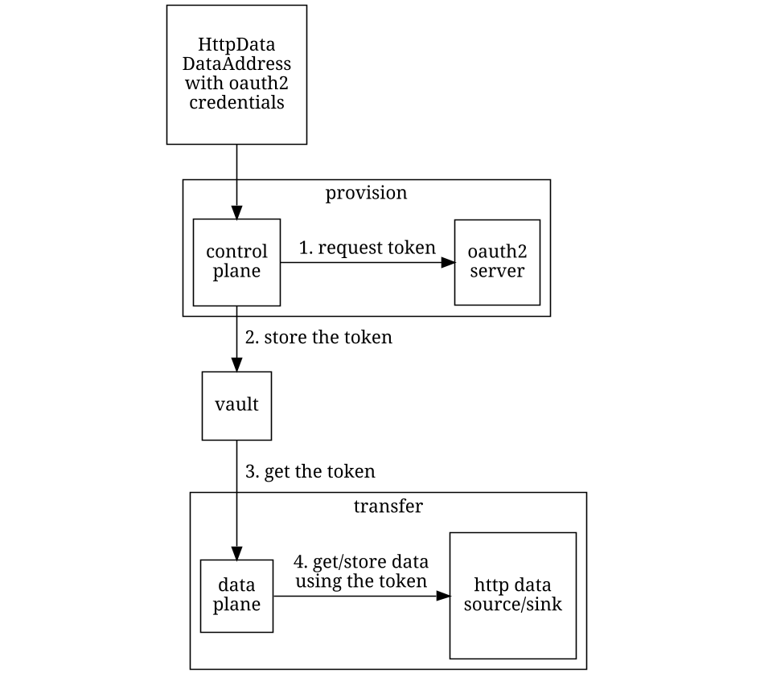

# OAuth2 Provision

This extension can be used when there's a data endpoint that requires OAuth2 authentication through the
[*client credentials flow*](https://auth0.com/docs/get-started/authentication-and-authorization-flow/client-credentials-flow)
It can be used both on **source** and **sink** side of the data transfer:
 - **source**: when the source data address contains the `oauth2` related properties, the **provider**'s provisioner
               will request a token and store it in the vault, then the `data-plane-http` extension will get the token
               to authenticate the data request call.
 - **sink**: when the destination data address contains the `oauth2` related properties, the provisioner of the
             participant that will store the data will request a token and store it in the vault, then the 
             `data-plane-http` extension will get the token to authenticate the data request call.

Please note that this extension doesn't currently support neither expiration nor refresh tokens, as they are not 
mandatory specifications that are up to the OAuth2 server implementation used.

## How it works

The token will be requested in the provision phase and stored in the vault, then it will be used by the `data-plane-http`
extension and put in the request. This can happen either on source side (by the provisioner) or on the sink side (either 
by consumer or provider).

## How to use it

The extension works for all the `HttpData` addresses that contain the "oauth2" properties (defined in 
[Oauth2DataAddressSchema](src/main/java/org/eclipse/edc/connector/provision/oauth2/Oauth2DataAddressSchema.java)):
- `oauth2:clientId`: the client id 
- `oauth2:clientSecret`: the client secret
- `oauth2:tokenUrl`: the url where the token will be requested

