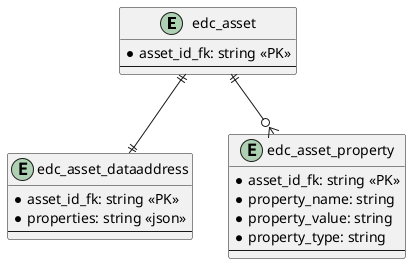

# SQL Asset

Provides SQL persistence for assets.

## Prerequisites

Please apply this [schema](docs/schema.sql) to your SQL database.

## Entity Diagram


<!--

-->

## Configuration

| Key | Description | Mandatory | 
|:---|:---|---|
| edc.datasource.asset.name | Datasource used by this extension | X |

## Migrate from 0.3.1 to 0.3.2

This table structure has been changed, from 3 tables (one for the asset, one for properties and one for data address) to
a single table with json fields.
To migrate an existing database, please first add the 3 new columns in the `edc_asset` table:
```sql
alter table edc_asset 
add column properties json default '{}',
add column private_properties json default '{}',
add column data_address json default '{}';
```

Then migrate the existing data in the new format:
```sql
update edc_asset set 
properties=(select json_object_agg(property_name, property_value) from edc_asset_property where asset_id_fk = edc_asset.asset_id and property_is_private = false),
private_properties=(select json_object_agg(property_name, property_value) from edc_asset_property where asset_id_fk = edc_asset.asset_id and property_is_private = true),
data_address=(select properties from edc_asset_dataaddress where asset_id_fk = edc_asset.asset_id);
```

After the migration, the tables `edc_asset_dataaddress` and `edc_asset_property` can be deleted.
