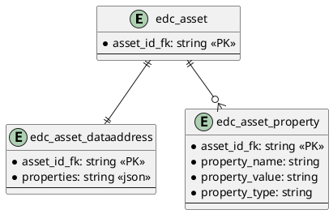

# SQL Asset

Provides SQL persistence for assets.

## Prerequisites

Please apply this [schema](docs/schema.sql) to your SQL database.

## Entity Diagram

<!--

-->

## Configuration

| Key | Description | Mandatory | 
|:---|:---|---|
| edc.datasource.asset.name | Datasource used by this extension | X |
