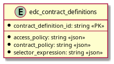

# SQL Contract Definition

Provides SQL persistence for contract definitions.

## Prerequisites

Please apply this [schema](src/main/resources/contract-definition-schema.sql) to your SQL database.

## Entity Diagram



## Migrate to per-participant contract definition ids

Contract definition ids are unique only within a participant context: the primary key of `edc_contract_definitions` is
the pair `(participant_context_id, contract_definition_id)`. To migrate an existing database created with a previous
schema version, replace the primary key (the constraint name below is the default one generated by PostgreSQL, adapt it
if your database uses a different one):

```sql
ALTER TABLE edc_contract_definitions
    DROP CONSTRAINT edc_contract_definitions_pkey,
    ADD PRIMARY KEY (participant_context_id, contract_definition_id);
```

## Create a flexible query API to accommodate `QuerySpec`

_For the first version, only the `limit` and `offset` arguments from the `QuerySpec` will be used._

For subsequent versions it is recommended to re-use the `Clause` interface and its implementors, that were originally
implemented for CosmosDB, and create an equivalent set of clauses for SQL. Thus, there would be a `Limit-`, `Offset-`
, `Order-` and `WhereClause` for SQL.

That way, dialect-dependent variants can be implemented should the need arise, because the actual SQL statement is
encoded in those clauses, offering a fluent Java API.
