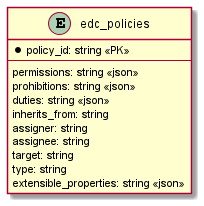
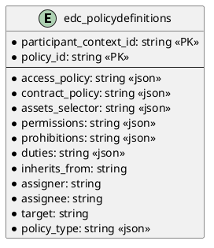

# SQL Policy Store

Provides SQL persistence for policies.

Note that the SQL statements (DDL) are specific to and only tested with PostgreSQL. Using it with other RDBMS may work
but might have unexpected side effects!

## Prerequisites

Please apply this [schema](src/main/resources/policy-definition-schema.sql) to your SQL database.

## Migrate to per-participant policy definition ids

Policy definition ids are unique only within a participant context: the primary key of `edc_policydefinitions` is the
pair `(participant_context_id, policy_id)`, and the unique index on `policy_id` alone is gone. To migrate an existing
database created with a previous schema version, replace the primary key and drop the index (the constraint name below
is the default one generated by PostgreSQL, adapt it if your database uses a different one):

```sql
DROP INDEX IF EXISTS edc_policydefinitions_id_uindex;
ALTER TABLE edc_policydefinitions
    DROP CONSTRAINT edc_policydefinitions_pkey,
    ADD PRIMARY KEY (participant_context_id, policy_id);
```

## Entity Diagram


<!--

-->
