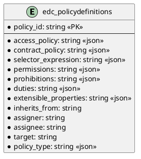

# SQL Policy Store

Provides SQL persistence for policies.

Note that the SQL statements (DDL) are specific to and only tested with PostgreSQL. Using it with other RDBMS may work
but might have unexpected side effects!

## Prerequisites

Please apply this [schema](schema.sql) to your SQL database.

## Entity Diagram

<!--

-->

## Configuration

| Key                        | Description | Mandatory | 
|:---------------------------|:---|---|
| edc.datasource.policy.name | Datasource used by this extension | X |
