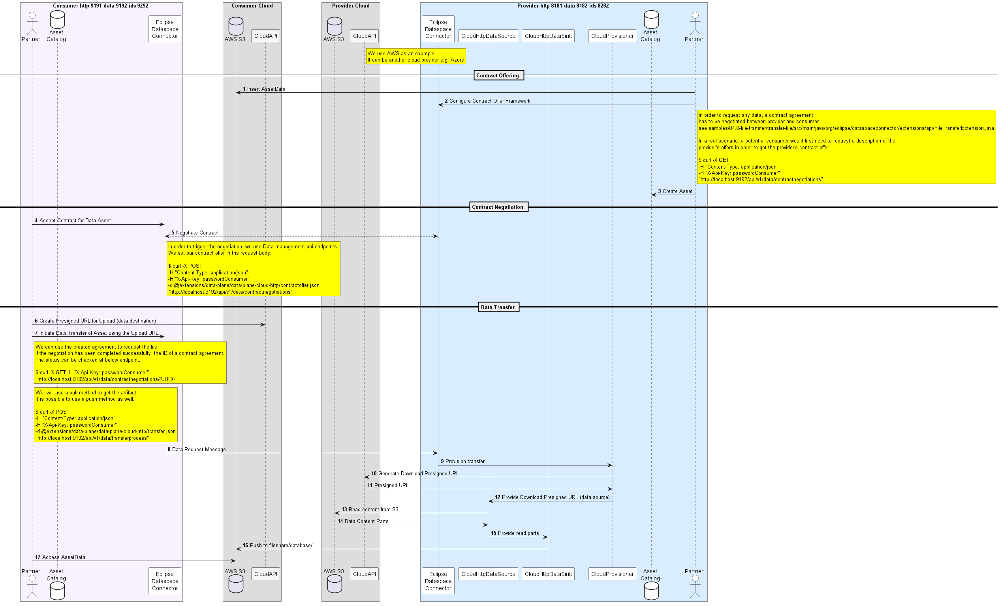

# Data Plane Presigned Endpoint HTTP extension

This extension provides support for sending data sourced from an HTTP endpoint and putting data to a cloud presigned url based HTTP endpoint when working with 
small files (< 50MB) and the cloud access is wrapped (therefore no direct access to the cloud API). By
nature of the DPF design, which supports _n_-way transfers, HTTP-sourced data can be sent to any `DataSink` type and an
HTTP endpoint can receive data from any `DataSource` type. The extension is designed to stream the full content at once since there is a single upload url 
and the expectation from cloud API perspective it that the full data gets pushed at once; this adds memory pressure for big files therefore it is recommended to 
use this extension for small files. It is possible to bypass this limitation by registering a resource definition multiple times, each one handling a single upload presigned url for a 
single part - note that the multiplart request need to be done first and the multipart id used for the later provisioners - see [Official AWS Doc](https://docs.aws.amazon.com/AmazonS3/latest/userguide/mpuoverview.html) and [Boto example](https://dev.to/traindex/multipart-upload-for-large-files-using-pre-signed-urls-aws-4hg4).

Note that Azure Object Storage or S3 extensions should be preferred to the current extensions when performing large data
transfers as it supports more scalable parallelization; note that they require the cloud credentials to be at hand.

Note that the presigned HTTP extension offers also the option of specifying additional headers (due to EDC limitation only as string) e.g. Azure authorization as header values like 
```json
"additionalHeaders" : "{\"Content-Type\" : \"application/octet-stream\",\"x-ms-blob-type\": \"BlockBlob\"}"
```


