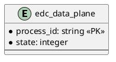

# SQL Data Plane Store

Provides SQL persistence for data flow transfer state.

## Prerequisites

Please apply this [schema](src/main/resources/dataplane-schema.sql) to your SQL database.

## Entity Diagram

-->
