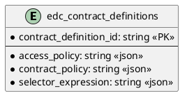

# SQL Contract Definition

Provides SQL persistence for contract definitions.

## Prerequisites

Please apply this [schema](docs/schema.sql) to your SQL database.

## Entity Diagram

<!--

-->

## Configuration

| Key | Description | Mandatory | 
|:---|:---|---|
| edc.datasource.contractdefinition.name | Datasource used by this extension | X |
