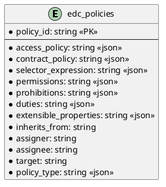

# SQL Policy Store

Provides SQL persistence for policies.

## Prerequisites

Please apply this [schema](docs/schema.sql) to your SQL database.

## Entity Diagram

<!--

-->

## Configuration

| Key                        | Description | Mandatory | 
|:---------------------------|:---|---|
| edc.datasource.policy.name | Datasource used by this extension | X |
